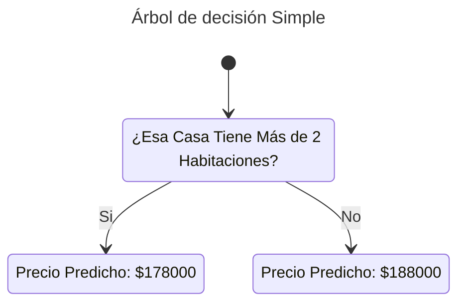
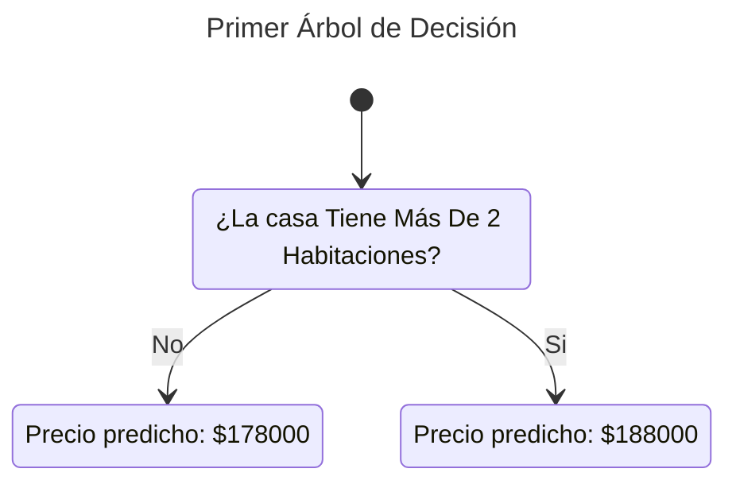
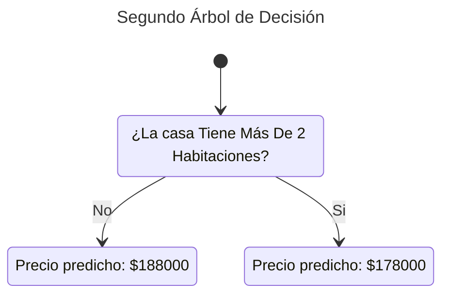
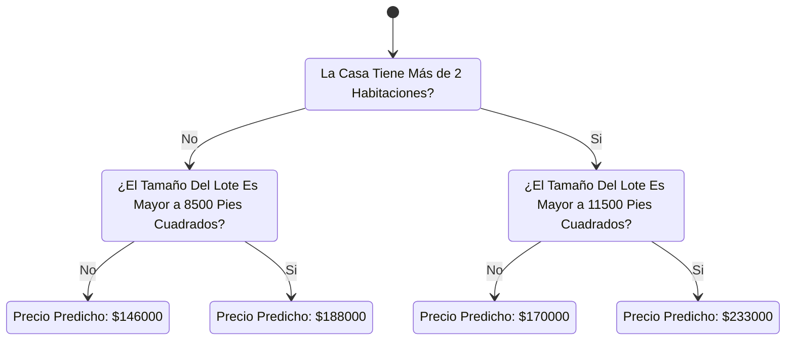

## Introducción
Empezaremos con un vistazo sobre cómo funcionan los modelos de machine learning y cómo se usan. Esto tal vez pueda sonar sencillo y básico si has realizado modelados estadísticos o machine learning antes. No te preocupes, vamos a avanzar para construir modelos muy pronto.

Esta nota te ayudará a construir modelos alrededor del siguiente escenario:
### Escenario

Tu primo ha hecho millones de dólares especulando en un estado real. Te ha ofrecido convertirte en su socio debido a tu interés en la ciencia de datos. El proveerá el dinero y tu vas a proveer los modelos que predigan cuán valiosa puede ser una casa entre muchas otras.

Decides preguntarle a tu primo cómo fue que solía predecir el valor de las casas en el pasado, y el contesta que todo se trata de tener intuición. Sin embargo, haciéndole más preguntas te das cuenta de que el solía identificar patrones en las casas que ya había visto antes, y usa aquellos patrones para hacer predicciones en las nuevas casas que va considerando.

El Machine Learning funciona de la misma manera. Esta vez empezaremos con un modelo llamado *Árbol de Decisión*. Hay modelos más bonitos y que dan predicciones más acertadas. Sin embargo, los árboles de decisión son fáciles de entender, y son el pilar inicial para construir algunos de los mejores modelos en la ciencia de datos.

Por simplicidad, vamos a empezar con el árbol de decisión más fácil:

Este árbol divide las casas en dos categorías. El precio predicho para cualquier casa por considerar corresponde al precio histórico en promedio de las casas en la misma categoría.

Usamos los datos para decidir cómo dividir las casas en dos grupos, y luego los usamos de nuevo para determinar el precio predicho en cada grupo. Este paso de capturar los patrones para los datos se suele llamar *Ajustar* o *Entrenar* el modelo. Los datos utilizados para ajustar el modelo se llaman los *Datos de Entrenamiento*.

Actualmente, decir cómo se entrena un modelo (Ej: Cómo separar los datos) es algo complejo, así que lo guardaremos para más tarde. Después de que el modelo se ha ajustado, puedes aplicarlo a nuevos datos para *Predecir* los precios de otras casas.

## Mejorando el Árbol de Decisión
Cuál de los siguientes dos árboles parece ser el resultado de ajustar los datos de ventas reales?

El primer Árbol de Decisión tal vez tiene más sentido, debido a que capta la realidad en la que las casas con más habitaciones tienden a venderse a precios más altos que las casas que tienen menos habitaciones. El mayor defecto de la aplicación es que no captura la mayoría de factores que afectan el precio de un hogar, como el número de baños, el tamaño del lote, la ubicación... etc.

Puedes capturar más factores usando un árbol que tenga más *divisiones*. Estos son llamados árboles más *profundos*. Un árbol de decisión que también considera el tamaño total del lote por cada casa se ve así:

Por lo tanto, podemos decir que tu forma de predecir el precio de cada casa se basará en navegar a través del árbol de decisión, siempre escogiendo el camino correspondiente a las características del hogar. El precio predicho para las casas estará en la parte más baja del árbol. El punto más bajo en donde hacemos una predicción es llamado *Hoja*.

Las divisiones y los valores en las hojas serán determinados por los datos, así que es hora de que revises con qué datos estarás trabajando. 