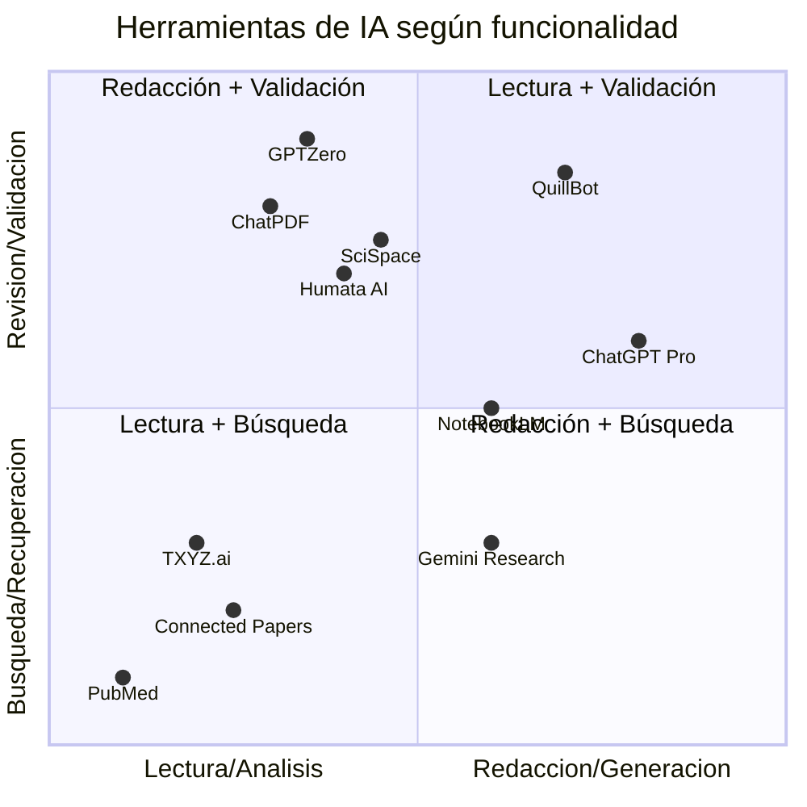

**Guía Complementaria a la Mentoría | Junio 2025**
Por *Santiago Naranjo Herrera*

# Introducción

La irrupción de los modelos de inteligencia artificial generativa (IA-G) ha transformado significativamente la forma en que los investigadores pueden aproximarse a sus procesos de búsqueda, análisis, redacción y publicación de conocimientos científicos. Herramientas como ChatGPT, Gemini, TXYZ o SciSpace permiten automatizar tareas repetitivas, organizar ideas, validar hipótesis y mejorar la claridad de los escritos, todo a partir de una interacción en lenguaje natural.

Esta guía tiene como propósito servir como referencia práctica para el investigador médico, presentando una ruta concreta para aplicar la IA de forma efectiva y responsable a lo largo del ciclo investigativo. Cada sección recoge recomendaciones, flujos de trabajo sugeridos y prompts que pueden ser adaptados según el tipo de estudio que se esté desarrollando.

---

## Flujo de Trabajo Recomendado

La aplicación de la IA en investigación no se limita a una sola etapa, sino que puede acompañarte a ti como investigador desde el momento en el que formulas y planteas una pregunta hasta la publicación del artículo final. El siguiente flujo propone una secuencia de pasos para integrar herramientas de IA de forma efectiva y segura:

1. **Planteando una pregunta de investigación**: Se puede utilizar IA para refinar una idea inicial, delimitar objetivos específicos o transformar un planteamiento amplio en una pregunta clara y viable. Modelos como ChatGPT pueden ofrecer reformulaciones, detectar ambigüedades o incluso sugerir enfoques comparativos.
    
2. **Realizando una Búsqueda de literatura científica**: Con herramientas como TXYZ, Gemini o Perplexity, es posible solicitar artículos recientes sobre un tema específico, priorizando aquellos con DOI o revisiones sistemáticas. Posteriormente, se recomienda verificar esta información en bases especializadas como PubMed o Semantic Scholar.
    
3. **Por medio De Una Lectura asistida**: Una vez reunida la literatura, plataformas como ChatPDF, Humata o SciSpace permiten resumir artículos, extraer resultados clave o formular preguntas sobre el contenido. Esto optimiza el tiempo y facilita la comprensión crítica de cada documento.
    
4. **En la Redacción del manuscrito**: La IA puede colaborar en la escritura de borradores, sugiriendo estructuras, redactando resúmenes o reformulando secciones con un estilo académico. Su uso es especialmente útil en la redacción de introducciones y discusiones.
    
5. **Revisión ética y editorial**: En esta etapa, el investigador puede utilizar IA para verificar la claridad, detectar errores gramaticales o revisar el cumplimiento del estilo de la revista. También se pueden realizar chequeos preliminares de similitud textual y cumplimiento ético.
    

---

## Herramientas clave
La siguiente tabla resume algunas de las herramientas mencionadas durante la mentoría, según su función principal. Estas herramientas son accesibles desde navegador y no requieren conocimientos técnicos para su uso:

- [**ChatGPT (Pro)**](https://chatgpt.com/): Plataforma de interacción con modelos de lenguaje. Permite cargar archivos, redactar contenido, hacer resúmenes, corregir estilo y generar ideas. Requiere suscripción para funciones avanzadas.
    
- [**Gemini Deep Research**](https://gemini.google.com/app): Servicio de Google que crea planes de investigación estructurados y realiza búsquedas avanzadas en la web para temas específicos. Muy útil para temas multidisciplinarios o revisiones narrativas.
    
- [**TXYZ.ai**](https://www.txyz.ai/): Integra fuentes científicas y permite filtrar artículos recientes, priorizando contenido con DOI y resumen detallado. Ofrece una interfaz clara para búsquedas orientadas.
    
- **[PubMed](https://pubmed.ncbi.nlm.nih.gov/) / [Semantic Scholar](https://www.semanticscholar.org/)**: Bases de datos confiables para validar artículos obtenidos con IA. Permiten filtrar por nivel de evidencia, tipo de estudio, idioma y acceso abierto.
    
- [**Connected Papers**](https://www.connectedpapers.com/): Genera mapas visuales de relaciones entre artículos, facilitando la exploración de antecedentes, derivados y trabajos relacionados.
    
- **ChatPDF / SciSpace / Humata AI**: Herramientas para cargar y consultar artículos completos en formato PDF. Ideal para extraer datos clave o responder preguntas específicas sobre el documento.
    
- [**NotebookLM**](https://notebooklm.google.com/): Herramienta de Google para crear un sistema RAG (Generación aumentada por recuperación). Se puede usar con documentos propios.
    
- **[GPTZero](https://gptzero.me/) / [QuillBot](https://quillbot.com/ai-content-detector)**: Permiten verificar si un texto ha sido generado por IA (GPTZero) o reescribirlo para mejorar claridad y evitar similitud textual excesiva (QuillBot).
  



---

## Prompts recomendados

A la hora de utilizar estos modelos de lenguaje me gusta comparar un prompt con una instrucción dada a una persona en la vida real: Cuanto mejor le especifiques lo que deseas, mejor será el resultado que te otorgará el modelo.Por lo tanto, aquí te listo algunos cuantos ejemplos de prompts organizados por tarea:

**Búsqueda de artículos científicos:**

```
Busca artículos recientes (2023–2024) sobre el uso de [tema] en cardiología. Incluye DOI si es posible.
```

```
Dame un resumen de los hallazgos clave de los últimos 5 metaanálisis sobre [tema clínico].
```

**Lectura asistida:**

```
Resume este artículo técnico en 5 puntos clave. 
[pega abstract o fragmento]
```

**Redacción y mejora de estilo:**

```
Reescribe este párrafo en tono académico claro y riguroso: 
[pega texto]
```

```
Corrige la gramática y mejora la claridad de este fragmento, sin cambiar el contenido: 
[pega texto]
```

**Adaptación editorial:**

```
Adapta este resumen al estilo de redacción de la Revista Colombiana de Cardiología.
```

**Revisión editorial automatizada:**

```
Actúa como editor de una revista médica. Revisa el siguiente abstract y sugiere mejoras en claridad, redacción y estructura:
[pega abstract]
```

---

## Buenas prácticas éticas

El uso responsable de la inteligencia artificial en investigación académica requiere seguir principios de transparencia, honestidad y rendición de cuentas. Si bien las herramientas de IA pueden asistir en la escritura o revisión, se debe documentar su participación dentro de la construcción de nuevo material, especialmente si contribuyeron al contenido textual final.

No es apropiado considerar a un modelo de IA como un coautor, ni permitir que redacte secciones críticas sin supervisión. Además, es un deber del investigador asegurarse de no introducir contenido fabricado o referencias falsas, y utilizar verificadores de plagio si se han usado reformulaciones automáticas. Muchas revistas científicas ya han publicado lineamientos explícitos sobre el uso de IA, y es recomendable revisar estas políticas antes de enviar un manuscrito.


>[!FAQ] Cómo podemos atribuir el uso de la IA en nuestras investigaciones?
>
>“Los autores verifican y asumen la total responsabilidad por el uso de la IA generativa en la preparación de este manuscrito. La IA generativa, específicamente [Nombre de la Herramienta], se empleó para ayudar en la redacción de la revisión de la literatura y los esquemas iniciales de las secciones de metodología y recomendaciones políticas”
>
>“Todo el contenido generado por IA fue meticulosamente revisado, editado y validado por los autores para garantizar la precisión, originalidad y cumplimiento de los estándares académicos y éticos. Las interpretaciones, análisis y conclusiones finales presentadas en este manuscrito fueron desarrolladas únicamente por los autores sin asistencia de IA”


### Algunos Prompts Útiles Para la Edición de Texto con IA

##### **Claridad y estructura**

**Prompt:**
Actúa como editor de una revista médica. Revisa el siguiente abstract y señala incoherencias entre el objetivo, los resultados y la conclusión:
[pega abstract aquí]

**Prompt:**

Sugiere cómo reorganizar este párrafo para mejorar su claridad lógica, sin cambiar el contenido científico:
[pega párrafo aquí]


#### **Estilo y tono académico**

  **Prompt:**
Revisa este texto y sugiere mejoras en tono académico, precisión técnica y estilo editorial propio de una revista médica:
[pega fragmento aquí]

 
**Prompt:**
Corrige este abstract para que tenga un lenguaje claro, técnico y sintético, apropiado para su envío a revisión por pares:
[pega abstract aquí]

#### **Evitar el sobreuso de IA (prompts éticos)**

  

**Prompt:**
Dame sugerencias editoriales para mejorar este texto, sin reescribirlo por completo. Quiero conservar el estilo del autor:
[pega texto aquí]


**Prompt:**
Resalta frases repetitivas o poco claras en este fragmento, pero no las modifiques. Solo señálalas:
[pega fragmento aquí]

#### **Evaluación general**

**Prompt:**

Evalúa este resumen desde una perspectiva editorial: ¿Es claro? ¿Está bien estructurado? ¿Faltan elementos esenciales como conclusión o relevancia?
[pega resumen aquí]


## Recomendaciones finales

Esta guía pretende ser un punto de partida para integrar progresivamente la IA al trabajo científico. Se recomienda comenzar aplicándola en tareas específicas, como la redacción de resúmenes o revisión de claridad textual, y avanzar hacia flujos más integrados como la lectura asistida de documentos o la generación aumentada por recuperación (RAG).

La inteligencia artificial no reemplaza el juicio clínico ni el pensamiento crítico del investigador, pero sí puede potenciar significativamente su productividad, ampliar sus capacidades de análisis y reducir el tiempo invertido en tareas repetitivas. El criterio profesional seguirá siendo insustituible, pero ahora puede contar con una caja de herramientas poderosa a su servicio.


# Referencias

- “Transformer: A Novel Neural Network Architecture for Language Understanding”.  [En línea]. Disponible en: [https://research.google/blog/transformer-a-novel-neural-network-architecture-for-language-understanding/](https://research.google/blog/transformer-a-novel-neural-network-architecture-for-language-understanding/)
- A. Vaswani _et al._, “Attention Is All You Need”, _arXiv_: arXiv:1706.03762. doi: [10.48550/arXiv.1706.03762](https://doi.org/10.48550/arXiv.1706.03762).
- “TXYZ: Una plataforma impulsada por IA que integra caminos de conocimiento para la investigación, el aprendizaje y la resolución de problemas.”  [En línea]. Disponible en: [https://www.toolify.ai/es/tool/txyz-ai](https://www.toolify.ai/es/tool/txyz-ai)
- “Prompt Engineering Guide”. [En línea]. Disponible en: [https://www.promptingguide.ai/es/introduction/basics](https://www.promptingguide.ai/es/introduction/basics)
- “¿Qué es RAG?: explicación de la IA de generación aumentada por recuperación, AWS”, Amazon Web Services, Inc. [En línea]. Disponible en: [https://aws.amazon.com/es/what-is/retrieval-augmented-generation/](https://aws.amazon.com/es/what-is/retrieval-augmented-generation/)
- “¿Qué son los modelos básicos? - Explicación sobre los modelos básicos en la IA generativa - AWS”, Amazon Web Services, Inc. [En línea]. Disponible en: [https://aws.amazon.com/es/what-is/foundation-models/](https://aws.amazon.com/es/what-is/foundation-models/)
- “¿Qué es la IA generativa? | IBM”. [En línea]. Disponible en: [https://www.ibm.com/mx-es/think/topics/generative-ai](https://www.ibm.com/mx-es/think/topics/generative-ai)
- R. Gao _et al._, “Legal regulation of AI-assisted academic writing: challenges, frameworks, and pathways”, _Front. Artif. Intell._, vol. 8, abr. 2025, doi: [10.3389/frai.2025.1546064](https://doi.org/10.3389/frai.2025.1546064).

