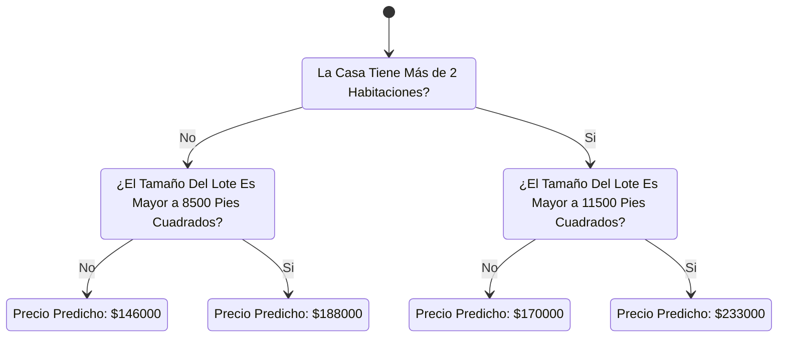

## Experimentando con Modelos Diferentes

Ahora que tienes una forma confiable de medir la precisión del modelo, puedes experimentar con diferentes modelos y ver cual te da las mejores precisiones Pero que alternativas tenemos para escoger?

En la [Documentación de Scikit-Learn](https://scikit-learn.org/stable/modules/generated/sklearn.tree.DecisionTreeRegressor.html) puedes ver que el modelo de árboles de decisión tiene muchas opciones (tantas que no las necesitarás hasta sino después de mucho tiempo). Las opciones más importantes determinan la profundidad del árbol. Recapitulando la primer lección dentro de estas notas, podemos denotar que la profundidad de un árbol se mide en cuántas veces se tiene que dividir antes de llegar a una predicción. Este es un árbol de poca profundidad:



En la práctica, no es poco común que un árbol se divida 10 veces entre el nivel superior (Todas las casas) y las hojas. El dataset almacena un conjunto cada vez más dividido y con menos casas entre más profundo se vuelve el árbol. Si el árbol solo tiene una división, entonces divide los datos en dos grupos. Si cada grupo se vuelve a dividir, ahora tendremos 4 grupos de casas. Dividirlos de nuevo causa tener 8 grupos de casas en total, y si seguimos doblando el número de divisiones tendremos $2^{10}$ grupos de casas cuando lleguemos a la división número 10. Eso serían 1024 hojas.

Cuando dividimos las casas entre más hojas, también tenemos menos casas por cada hoja. Las hojas con menos casas, harán predicciones que se acercan más a los valores actuales, pero pueden conducir a predicciones poco reales para nuevos datos (porque cada predicción se basa en solo unas pocas casas).

Este fenómeno es conocido como un **sobreajuste**, en donde un modelo coincide con los datos de entrenamiento casi de forma perfecta, pero tiene un rendimiento pésimo al momento de ser validado con datos nuevos. Por el otro lado, si hacemos que nuestro árbol tenga poca profundidad, no dividirá las casas en grupos distintos.

En un caso extremo, si un arbol divide las casas en solo 2 o 4 grupos, cada grupo seguirá teniendo una cantidad considerable de casas, haciendo que las predicciones se alejen de la mayoría de las casas, incluso dentro de los datos de entrenamiento (y por lo mismo, tampoco dará buenas señales al momento de ser validado). Cuando un modelo falla por capturar distinciones importantes y patrones en los datos, también fallará en los datos de entrenamiento, lo cual se conoce como una **insuficiencia**.

Como nos preocupamos por la precisión en nuevos datos, los cuales estimamos por medio de nuestros datos de validación, queremos encontrar el punto correcto entre el sobreajuste y la insuficiencia. Visualmente, queremos el punto más bajo de la curva roja de validación en la gráfica de abajo:

![[equilibrioEnModelos.png]]

## Ejemplo

Hay unas cuantas alternativas para controlar la profundidad de un árbol, y muchas de ellas permiten a algunas rutas ir a través del árbol para tener una mayor profundidad que otras. Pero, el argumento `max_leaf_nodes` nos da una forma sencilla de controlar la insuficiencia en contra del sobreajuste. Entre más hojas le dejamos crear al modelo, más nos movemos del punto de la insuficiencia expresada en la gráfica superior, hacia el área del sobreajuste.

Podemos usar una función de utilidad para ayudar a comparar las puntuaciones del error medio absoluto de diferentes valores para `max_leaf_nodes`:

```python
from sklearn.metrics import mean_absolute_error
from sklearn.tree import DecisionTreeRegressor

def get_mae(max_leaf_nodes, train_X, val_X, train_y, val_y):
    model = DecisionTreeRegressor(max_leaf_nodes=max_leaf_nodes, random_state=0)
    model.fit(train_X, train_y)
    preds_val = model.predict(val_X)
    mae = mean_absolute_error(val_y, preds_val)
    return(mae)
```

Los datos se cargan dentro de `train_X`, `val_X`, `train_y` y `val_y` usando el código que ya has visto y escrito.

```python
# Data Loading Code Runs At This Point
import pandas as pd
    
# Load data
melbourne_file_path = '../input/melbourne-housing-snapshot/melb_data.csv'
melbourne_data = pd.read_csv(melbourne_file_path) 
# Filter rows with missing values
filtered_melbourne_data = melbourne_data.dropna(axis=0)
# Choose target and features
y = filtered_melbourne_data.Price
melbourne_features = ['Rooms', 'Bathroom', 'Landsize', 'BuildingArea', 
                        'YearBuilt', 'Lattitude', 'Longtitude']
X = filtered_melbourne_data[melbourne_features]

from sklearn.model_selection import train_test_split

# split data into training and validation data, for both features and target
train_X, val_X, train_y, val_y = train_test_split(X, y,random_state = 0)
```

Podemos usar un ciclo for para comparar la precisión de los modelos construidos con diferentes valores para `max_leaf_nodes`.

```python
# compare MAE with differing values of max_leaf_nodes
for max_leaf_nodes in [5, 50, 500, 5000]:
    my_mae = get_mae(max_leaf_nodes, train_X, val_X, train_y, val_y)
    print("Max leaf nodes: %d  \t\t Mean Absolute Error:  %d" %(max_leaf_nodes, my_mae))
```

```
Max leaf nodes: 5  		 Mean Absolute Error:  347380
Max leaf nodes: 50  		 Mean Absolute Error:  258171
Max leaf nodes: 500  		 Mean Absolute Error:  243495
Max leaf nodes: 5000  		 Mean Absolute Error:  254983
```

De las opciones listadas, 500 es el número óptimo de hojas.

## Conclusión

Así está la cosa, los modelos pueden llegar a sufrir ambas cosas:

- **Sobreajuste**: Capturar patrones que no van a ser importantes en un futuro, llevando a predicciones menos precisas, o
- **Insuficiencia**: Fallar en capturar patrones relevantes, de nuevo llevando a predicciones menos precisas.

Usamos los datos de **validación**, los cuales no son usados en el entrenamiento del modelo, para medir la precisión candidata de un modelo, lo que nos permite probar a varios candidatos y quedarnos con el mejor.