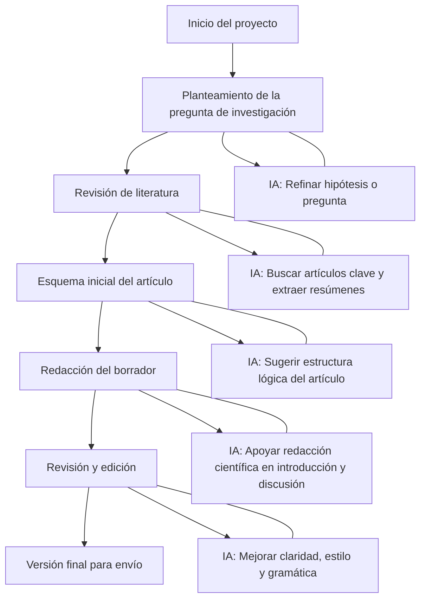

## 🎯 Objetivo general

Capacitar en el uso estratégico de herramientas de inteligencia artificial (IA) como ChatGPT y Gemini, enfocadas en mejorar procesos de búsqueda, lectura, redacción y revisión de literatura científica en el área de cardiología.

## Índice

### Día 1

- **Introducción a la IA Generativa**
	- Conceptos Iniciales
	- Cómo funcionan ChatGPT y Gemini?
	- Casos de Uso para Investigadores
	- LLMs Vs Bases de Datos Tradicionales.
- **Búsqueda de Literatura Científica**
	- Cómo utilizar herramientas de IA para encontrar artículos relevantes (con ejemplos).
	- Prompts Efectivos para:
		- Pedir Artículos recientes con DOI
		- Buscar Revisiones sistemáticas o metaanálisis.
		- Filtrar evidencia por Niveles (Ensayos clínicos, revisiones, etc.).
	-   Uso complementario de Bases como PubMed, Connected Papers, Semantic Scholar.
- **Lectura Asistida por IA**
	- Generación Aumentada por Recuperación (RAG)
	- Cómo usar la IA para resumir papers, extraer ideas clave, identificar limitaciones o proponer líneas de investigación.
	- Simulación: mostrar un artículo PDF y pedirle a las herramientas vistas que lo resuman, o que identifiquen qué aporta al estado del arte.
	
### Día 2

- **Escritura Académica con IA**
	- Cómo coescribir Abstracts, títulos, secciones de discusión o introduccion con IA.
	- Prompts para reescritura en tono académico, mejora de claridad, o adaptación al estilo de una revista.
	- Simulación: reescribir un párrafo de un artículo real.
- **Detección de Plagio y Ética de Uso**
	- Cómo puede la IA ayudar a detectar similitud textual (con herramientas como QuillBot, Turnitin, GPTZero).
	- Buenas prácticas éticas: evitar el ghostwriting automatizado, citar correctamente, documentar colaboración con IA.
	- Qué están diciendo las revistas sobre el uso de IA (Nature, Elsevier, etc.).
- **Rol de Editor con IA y Revisión por Pares**
	- Cómo se puede usar IA para proponer revisores, evaluar la lógica de manuscritos o comprobar la solidez y relevancia del documento.
	- Ejemplo: Revisión de un abstract y generación de sugerencias editoriales.

