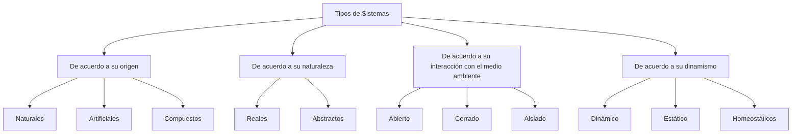

**Objetivo:** Analizar la respuesta dinámica de un sistema, su modelo matemático, la solución numérica (modelos de primer orden) y la representación en los dominios del tiempo ($t$) y la frecuencia($s$).

## Tipos de Sistemas

### Respuesta Dinámica

La respuesta dinámica de un sistema es la manera en que dicho sistema evoluciona en el tiempo cuando se le aplica una entrada o excitación externa (por ejemplo, una fuerza, un voltaje, una señal, un cambio de carga, etc.). En otras palabras, describe cómo varían las variables de salida del sistema con respecto al tiempo después de recibir una perturbación, no solo el estado final, sino también el comportamiento transitorio hasta que alcanza un equilibrio o régimen estable.

---

Un ejemplo de los sistemas automáticos podría ser encender un foco mediante un switch de luz, debido a que una fuerza externa actúa sobre un controlador para definir cuándo se encuentra encendido o cuándo se encuentra apagado.

Un modelo proporcional depende de la percepción de la persona, debido a que ya no tiene solamente 2 estados (Se actúa en función de un error). Los tipos de modelos de control son: Elemento proporcional, integral y un derivativo (PID), conocido como la línea de control análogo.

- La automática
- Automatismos industriales.
- Sistemas de fabricación.
- Realización tecnológica del control.
- Tipos de sistemas de automatización industrial.
- Ejemplos de sistemas de automatización industrial.

### Características Clave de la Respuesta Dinámica

- **Respuesta transitoria:** La forma en como responde el sistema desde el tiempo inicial al percibir el estímulo o entrada hasta que se estabiliza. Es la parte inicial de la salida, donde el sistema ajusta su estado tras recibir el estímulo (puede incluir oscilaciones, picos o amortiguamiento).
- **Respuesta en estado estacionario (Respuesta en estado estable o estabilidad):** Es el comportamiento final del sistema cuando el tiempo tiende al infinito (Ej: Velocidad constante de un motor después de un arranque).
- **Velocidad de Respuesta:** Qué tan rápido alcanza el equilibrio.
- **Estabilidad:** SI el sistema regresa o no a un estado estable después de la perturbación.
- **Sobreimpulso y Oscilaciones:** Si la salida supera temporalmente el valor deseado o presenta vibraciones.

## Sistemas de Primer Orden
### Características de los sistemas de primer orden

**Análisis hecho suponiendo una entrada escalón:**
![[Pasted image 20250905095833.png]]

![[Pasted image 20250905100118.png]]

- No tienen un tiempo muerto o un retardo de respuesta cuando hablamos de un análisis ideal.
- El **techo** es el nivel máximo de la salida (ganancia proporcional $a*k$ ).
- $\tau$ se considera como el tiempo que toma el sistema para responder y se define como el 63.2% de la amplitud.
- Tiempo de respuesta 4$\tau$.
- $k$ es la ganancia proporcional del sistema
- La respuesta está dada por $y_{(t)} = 1-e^{-\frac{t}{\tau}}$
### Representación de un Sistema de Primer Orden mediante Ecuación Diferencial Lineal

$a_{1}\frac{dy}{dt} + a_{0}y = b\,u(t)$

O de manera equivalente, tenemos a la ecuación diferencial característica del sistema de primer orden.
$\tau \frac{dy}{dt} + y = K\,u(t)$

Donde,
$\tau = \frac{a_{1}}{a_{0}} \qquad K = \frac{b}{a_{0}}$

$a1$ $a0$ y $b$ son variables constantes constantes.

**Ahora, la función mediante Laplace define una resolución en la frecuencia.**

$\frac{y(s)}{u(s)} = \frac{K}{\tau s + 1}$

Al cociente $\frac{y(s)}{u(s)}$ se le denomina la función de transferencia $G(s)$ :

$\frac{y(s)}{u(s)} = G(s)$

Donde para un sistema de primer orden existe su función de transferencia:

$G(s) = \frac{K}{\tau s + 1}$

**Respuesta a un escalón de un Sistema de Primer Orden G(S)**

$y(t) = uK(1-e^{-\frac{t}{\tau}})$

### Ejemplo

Un horno eléctrico se conecta a una red eléctrica monofásica de 127v para permitir hornear un pastel de maíz a 325ºC y se demora 130 segundos en alcanzar el 98% de esa temperatura. Determine la respuesta de primer orden que represente mejor el sistema en frecuencia y el tiempo. Grafique.

Determinamos la entrada: $127v$
La salida será una temperatura $t$.

1. Determine la ganancia proporcional = $K=\frac{\text{Temperatura en estado estable}}{\text{Voltaje de Entrada}}$
	1. $k=\frac{325c}{127v}$ por lo tanto $k = 2.56 \frac{c}{v}$
2. Se determina la constante de tiempo del sistema:
	1. Usando el criterio de 2% del error, se determina el tiempo que tarda la salida en alcanzar el 98% de su valor:
	2. Se considera que el tiempo aproximado de llegar al 98%, se da en cuatro constantes de tiempo, 4$\tau = 130 \text{segundos}$, por tanto: $\tau = 32.5\text{seg}$.
3. Se estima la función de transferencia (respuesta en frecuencia): $G(s) = T(s)/V(s)$
	1. $G(s)=\frac{2.56}{32.5S+1}$
4. Se estima la función respuesta/modelo (respuesta en el tiempo):
	1. $T(t) = (127)*(2.56)[1-e^{\frac{-t}{32.5}}$

## La Automática

La automática o control (automático) de sistemas trata de regular con la misma intervención humana, el comportamiento dinámico de un sistema mediante órdenes de mando.

**Sistema**: Conjunto de elementos físicos o abstractos relacionados entre sí de forma que modificaciones o alteraciones en determinadas magnitudes en uno de ellos pueden influir o ser influidas por los demás.

**Variables del sistema**: Magnitudes que definen el comportamiento de un sistema. Su naturaleza define el tipo de sistema: mecánico, químico, eléctrico, electrónico, económico, térmico, etc. (Siempre se representan por una magnitud y una unidad).

### Control Manual

1. Identificar si es un sistema (Tiene una entrada, un elemento de control y una salida).
2. Tiene un valor ($cm^3$ por segundo)
3. Tiene una variable de salida (Flujo de salida: $cm^3$ por segundo)
4. Señal de Control: (Una Válvula o cierre proporcional a un error)
5. Señal Medida (El nivel del Agua)
6. Señal de Referencia: Salida deseada o **Set Point**.

$\text{Error}=Vd-Vm$
$Vd = \text{Variable Deseada}$
$Vm = \text{Variable Medida}$

Cuando deseamos graficar la curva de la variable vs el tiempo, también lo conocemos como una respuesta dinámica.

Las variables de estado son un conjunto mínimo de variables del sistema tal que, conocido su valor en un instante dado, permiten conocer la respuesta (variables de salida) del mismo, ante cualquier señal de entrada o perturbación.

### Otras definiciones de interés:

De momento hablamos de estos conceptos teniendo como referencia un control analógico, sin embargo hay que tener en cuenta que también existe un control digital.

**Planta:** Equipo con el objetivo de realizar una operación o función determinada. Es cualquier equipo físico que se desea controlar (motor, horno, reactor, caldera, ...).

**Proceso:** Cualquier serie de operaciones que se desea controlar con un fin 
determinado.

**Perturbación:** Señal de comportamiento no previsible que tiende a afectar adversamente al valor de la salida de un sistema.

**Realimentación:** Operación que, en presencia de perturbaciones tiende a reducir la diferencia entre la salida y la entrada de referencia, utilizando la diferencia entre ambas como parámetro de control (tomar una muestra de la salida y reincorporarla a la entrada del sistema para mitigar las perturbaciones).

>[!info] Consultar
>**Qué es Hardware In The Loop & Software In The Loop**

**Servomecanismo:** Sistema de control realimentado en el cual la salida es una magnitud de tipo mecánico (posición, velocidad o aceleración).

**Sistema de regulación automática:** Sistema de control realimentando en el que la entrada de referencia y/o salida deseada varían lentamente con el tiempo.

**Control en bucle (lazo) abierto:** sistema de control en el que la salida no tiene efecto sobre la acción de control (Ejemplo: Lavadora, semáforos, ...)

**Control en bucle (lazo) cerrado:** Aquel en el que la salida tiene un efecto directo sobre la señal de control (utiliza la retroalimentación para reducir el error).

#### Primeros Ejemplos

- Reloj de Agua, Ktesibio (Flotador): 270 a.C.
- Lámpara de aceite de nivel constante, philon de Byzantinum. 250 a.C.
- J. Watt inventó en 1769, la máquina de vapor con regulador automático de velocidad.
- G Phillbrick comercializó en 1952, el primer amplificador operacional (electrónica analógica).
- T. Hoff (intel) desarrolla en 1971, el procesador 4004 (Electrónica Digital)

#### Control en lazo (o Bucle) Cerrado

La salida del sistema se mide por medio de un sensor que se compara con el valor de la entrada de referencia $u(t)$ (Señal de entrada).

De manera intuitiva se deduce que, de este modo el sistema de control podría responder mejor ante las perturbaciones que se produzcan sobre el sistema.

La respuesta del sistema se conoce como $y(t)$, y se retroalimenta a través del sensor.

conociendo la señal de entrada y la señal de error ($e(t)$) podemos conocer la variable medida.

Variable de control en el tiempo $v_{c(t)}$

**El sistema realimentado responde mejor ante las perturbaciones (Se mantiene estable).**

$e(t) = u(t)-Y_m(t)$
$u(t)= \text{Set Point(Deseada)}$
$Ym(t) = H(t) * y(T)$, en donde $H(T) = \text{Ganancia del Sistema}$
$v_{c(t)} = e(t)*Gc(t)$, en donde $Gc(t) = \text{Ganancia del Control (Regulacion)}$
$Va(t) = Vc(t) * Ga(t)$ en donde $Ga(t) = \text{Ganancia del Actuador (Motor, Valvula, Luz...)}$
$y(t) = \text{?}$

>[!info] Tarea
>Representar el diagrama de un lazo cerrado (Función de transferencia de un sistema) y realizar el análisis para representarlo en un diagrama de lazo abierto.

- Tabla de Integrales
- Tabla de derivadas
- Tabla de Transformadas de laplace
- Diagramas de bloques
- Soluciones de 10 casos de Baldor.

### Control automático
## Automatismos Industriales
