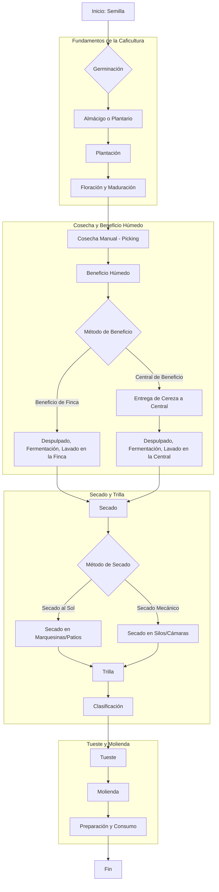

```mermaid
graph TD
    A[Inicio: Semilla] --> B{Germinación};
    B --> C[Almácigo o Plantario];
    C --> D[Plantación];
    D --> E[Floración y Maduración];
    E --> F[Cosecha Manual - Picking];
    F --> G[Beneficio Húmedo];
    G --> H{Método de Beneficio};
    H -- Beneficio de Finca --> I[Despulpado, Fermentación, Lavado en la Finca];
    H -- Central de Beneficio --> J[Entrega de Cereza a Central];
    J --> K[Despulpado, Fermentación, Lavado en la Central];
    I --> L[Secado];
    K --> L;
    L --> M{Método de Secado};
    M -- Secado al Sol --> N[Secado en Marquesinas/Patios];
    M -- Secado Mecánico --> O[Secado en Silos/Cámaras];
    N --> P[Trilla];
    O --> P;
    P --> Q[Clasificación];
    Q --> R[Tueste];
    R --> S[Molienda];
    S --> T[Preparación y Consumo];
    T --> U[Fin];

    subgraph Fundamentos de la Caficultura
        B; C; D; E;
    end

    subgraph Cosecha y Beneficio Húmedo
        F; G; H; I; J; K;
    end

    subgraph Secado y Trilla
        L; M; N; O; P; Q;
    end

    subgraph Tueste y Molienda
        R; S; T;
    end
```
