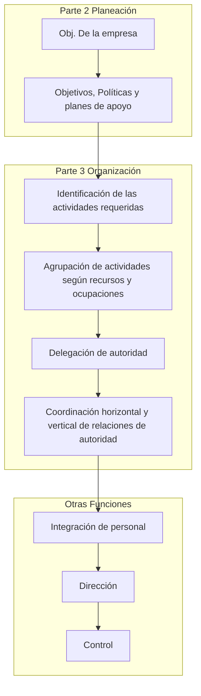
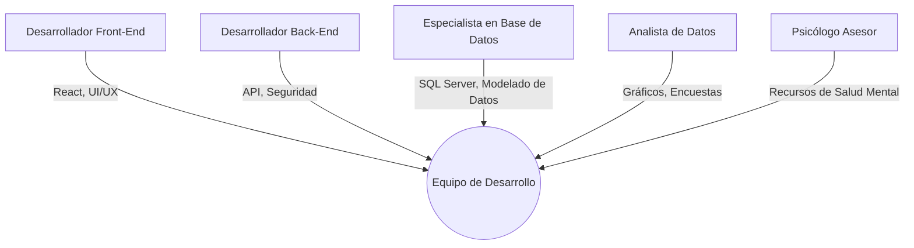

## Algunos Propósitos del Proceso de Organización
- Agrupar las diferentes tareas en unidades.
- Establecer relaciones entre individuos, grupos y departamentos.
- Determinar las lineas formales de autoridad.
- Asignar y desplegar los recursos de la organización.

## Procesos de Organización

## Organigrama Empresarial

Organigrama = (Órgamo = Órgano u Orgamismo + Grama = Gráfico)

Es la gráfica que representa la organización de una empresa o sea, su estructura organizacional.

### Desventajas del Organigrama
- Solo contiene relaciones formales de autoridad y omiten las numerosas relaciones informales significativas.
- También muestra las relaciones principales de línea o formales. Sin embargo no indica cuánta autoridad existe en cualquier punto de la estructura.
- Los individuos pueden confundir la gráfica con los niveles de estatus.

### Ejemplo 

## Departamentalización

Es la base sobre la cual se agrupan los trabajos a fin de alcanzar las metas organizacionales.

### Tipos
1. Departamentalización Funcional.
2. Departamentalización por Producto.
3. Departamentalización Geográfica.
4. Departamentalización por Procesos
5. Departamentalización por Clientes.
6. Departamentalización por Números.