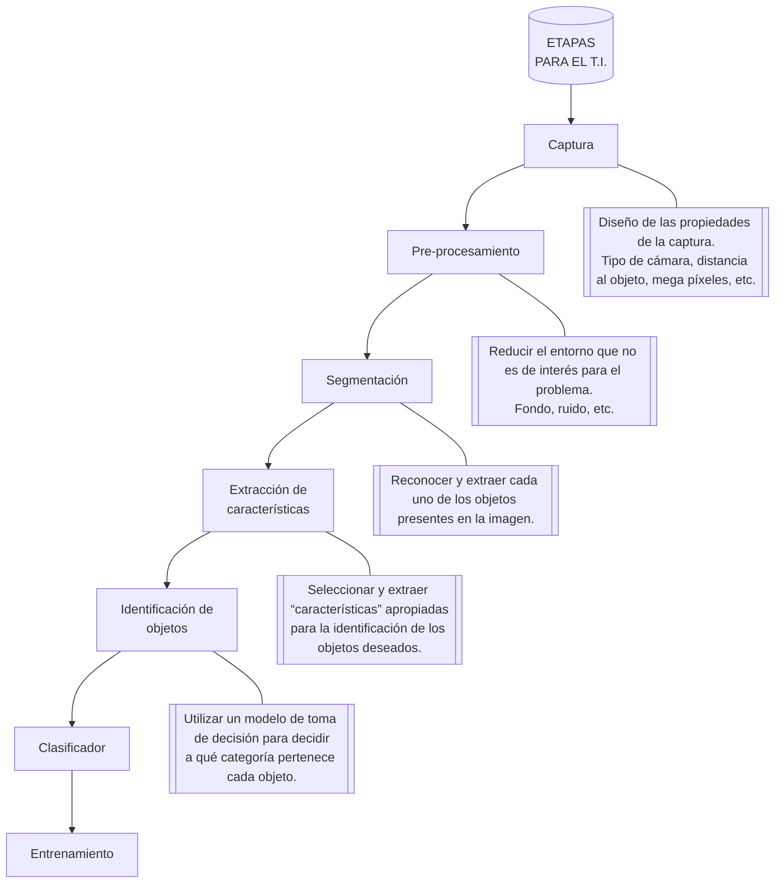

## Problemas a Resolver en el T.I

- La digitalización y codificación de la imágenes que facilite la transmisión, representación y almacenamiento de las mismas. 

CONSULTAR: PROCESO DE CONVERSIÓN DE ANÁLOGO A DIGITAL (Muestreo, Cuantificación y Codificación),

- Mejora y Restauración de una imagen para interpretar más fácilmente su contenido.
- Descripción y segmentación de imágenes para aplicaciones de visión robótica o visión artificial.

## Etapas para el T.I

## Propiedades Básicas

• El peso : Espacio que ocupa la imagen como archivo, medido en kilobits (Kb) o Megabits (Mb).

• El formato : Es el tipo de archivo en el que se guarda la imagen. Este viene dado por la extensión del archivo.

• La resolución : La imagen está formada por pequeños puntos llamados píxeles. La resolución es la cantidad de pixeles que tiene cada imagen por unidad de longitud. Una de las medidas más corrientes es ppp, que significa "pixeles por pulgada". A mayor resolución, mayor nitidez, pero también mayor peso de la imagen.

• El tamaño : Es la superficie que ocupa la imagen en su formato real, es decir sin ampliaciones ni reducciones. Puede medirse en centímetros, pulgadas, o en píxeles. Sin embargo la medida en píxeles está condicionada por la resolución.

• Color : Existen varios tipos de color para las imágenes, Para una fotografía necesitaremos todos los colores, por lo que utilizaremos la opción de "color real". Sin embargo para dibujos podemos usar la "paleta de colores" reduciendo el número de colores a 256 o a 16. Podemos también pasar la imagen a blanco y negro, sepia, o algún otro tono monocromático. El peso de la imagen dependerá también del número de colores usados. A más colores, mayor peso.
## Cómo Realizar el Tratamiento de Imagen?

No existe una técnica única o metodología en el tratamiento de imágenes que indique los diferentes filtros o máscaras que se le deba aplicar a una imagen para resolver un problema en particular. Por consiguiente, el tratamiento de imagen se fundamenta en la mejora de las características del objeto de estudio; para lo cual, cada diseñador aplica las técnicas de T.I en función del conocimiento previo y del ensayo y del error.

Una máscara, filtro, o kernel se refiere al mismo concepto: Un proceso que se hace sobre la imagen para tratarla o modificarla.

Dada una matriz $a$ de $m*n$ y una matriz $c$ de $(2N+1) * (2N+1)$ con $(2N+1) < n*m$, se define la convolución de las matrices $A y C$ como una nueva matriz $D = A * C$ definida a través de la expresión:

$$
\begin{equation}

    d_{ij} = \frac{1}{c} \sum_{r=1}^{2N+1} \sum_{s=1}^{2N+1} a_{i-N+r-1, j-N+r-1} C^{r,s}

\end{equation}
$$

donde $( c = \sum_{i,j=1}^{2N+1} c_{i,j})$  $si ( c = 0 )$ se toma $( c = 1 ))$. Obsérvese que $( d_{ij} )$ sólo está definido para 

$( i = N+1, \dots, m-N-1 )$ y $( j = N+1, \dots, n-N-1 )$.