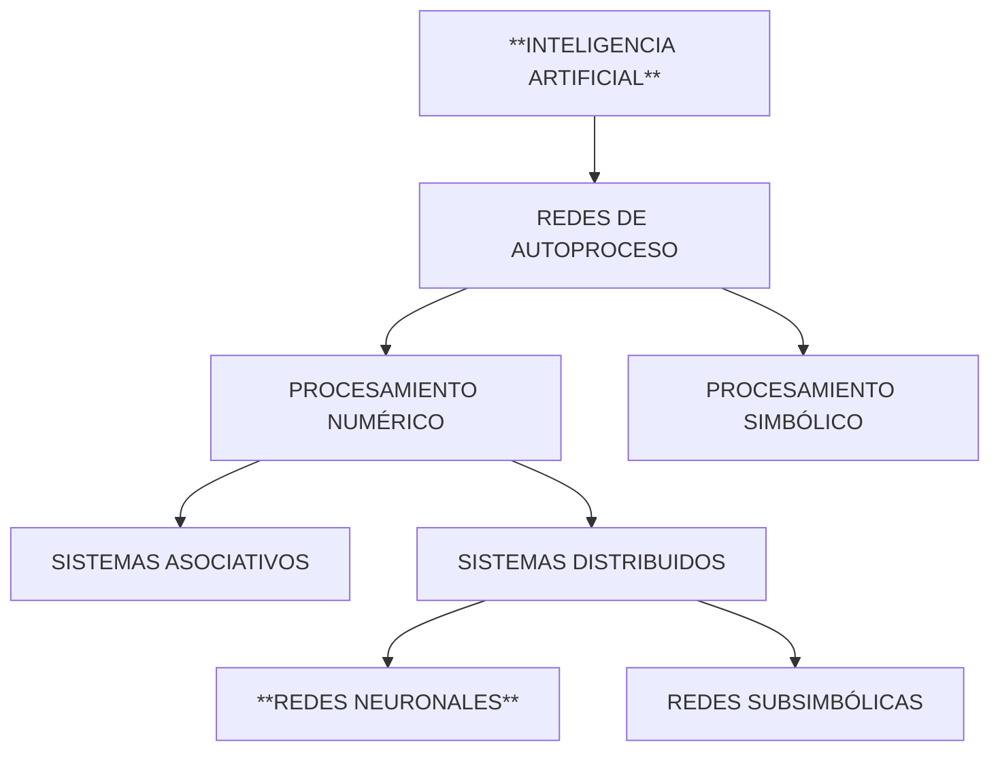

 A lo largo de los últimos años ha surgido una tendencia basada en replicar diferentes estrategias basadas en la naturaleza de los seres humanos para resolver distintos problemas que no pueden describirse de una forma tradicional (problemas como la toma de decisiones o el reconocimiento de formas). Una de estas estrategias que son introducidas en el libro trata de la utilización de las Redes Neuronales Artificiales, mencionando una combinación con la metodología de lógica difusa.

# Capítulo 1: Una Introducción A La Computación Neuronal

Cuando se hace alusión a un sistema neuronal, se puede pensar en un control centralizado de varias funciones biológicas debido a que algunas de ellas son responsables de abastecer de energía al cuerpo del ser. Este se conecta con su metabolismo, el control cardiovascular y la respiración.

Sin embargo, cuando se habla de un sistema de computación neuronal, solo se tienen en cuenta las funciones sensoriales y motoras, junto con una clase de proceso interno al que podemos llamar pensamiento. Sin embargo, a lo largo del desarrollo de la tecnología se encamina al hecho de desarrollar nuevas funciones para las máquinas, que permitan extender a la máquina para que puedan ser capaces de ver u oír.
## Panorama Histórico

En un principio, todos los esfuerzos llevados a cabo en la construcción de máquinas o técnicas apuntaban a la creación de sistemas que pudiesen llevar a cabo alguna función o acción de los seres humanos con más o menos precisión, y muchas veces lograba ser posible gracias al mejoramiento de la infraestructura más que a el mejoramiento de algún algoritmo. Con el tiempo esto fue evolucionando hasta que ya no fue un aspecto de simple habilidad, sino también de una disponibilidad implícita (como podemos ver con los sistemas expertos), por lo que con este avance podemos evidenciar que actualmente existen diversas formas de realizar procesos similares a los inteligentes y que pueden encajar dentro de la definición de una Inteligencia Artificial.

Sin embargo existe un limitante, y es que las máquinas solo tienen la capacidad de resolver rápidamente las tareas que son mecánicas, como el cálculo, la ordenación o el control; pero, por el contrario, les cuesta realizar acciones que serían sencillas para un ser humano con cierta rapidez, como el hecho de reconocer formas o hablar. A este limitante se le conoce comúnmente con el término de "paralelismo".

La idea con este proceso de desarrollo no es construir una competencia directa con el ser humano sino una herramienta con un rango intelectual similar que pueda ayudarle, debido a que muchos de estos sistemas pueden llegar a estar mejores dotados que los propios humanos y pueden llegar a realizar trabajos pesados sin llegar a "cansarse" (entendiendo el concepto de cansancio como la sensación de un agotamiento físico).

Para que el concepto de una aplicación de una red neuronal artificial fuese posible, primero se tuvieron que realizar múltiples estudios sobre el cerebro y sus capacidades. Las primeras explicaciones sobre el funcionamiento del pensamiento fueron dadas por Platón y Aristóteles, que fueron utilizadas por los filósofos empiricistas del siglo XVIII.

Gracias a estos primeros planteamientos, Alan Turing realizó los primeros estudios del cerebro desde la perspectiva del mundo de la computación en el año 1936. Posteriormente, en el año 1943, surgieron los primeros planteamientos teóricos sobre la concepción de la computación neuronal gracias a Warren McCulloch y Walter Pitts, un neurofisiólogo y un matemático respectivamente, quienes tenían una teoría sobre la forma en la que funcionaban las neuronas mediante el modelamiento de una red neuronal simple a través de circuitos eléctricos.

Luego, en 1957 empezó el desarrollo de un Perceptrón, el cual es un modelo de red neuronal que pudo reconocer patrones y generalizar, sin embargo tenía ciertas limitantes al momento de resolver algunos problemas de complejidad elevada. Estos problemas se vieron cada vez más abordados por medio de la construcción de más capas dentro del modelo debido a que el original solo disponía de una, lo que limitaba su capacidad de procesamiento.

Afortunadamente, la teoría dejó de ser solamente un concepto cuando en 1959 y gracias a la ayuda de Bernard Widrow y Marcial Hoff se desarrolló el primero modelo de red neuronal aplicado a un problema real que se ha usado de forma comercial durante décadas (eliminar interferencias en las lineas telefónicas), el modelo ADALINE (ADAptative LINear Elements).

En los años 60 se profundizó mucho más en la recreación de los mecanismos de la parecepción y la memoria. A mediados de 1967, Stephen Grossberg, uno de los mayores investigadores sobre redes neuronales hasta la época, realizó una red que consistía de elementos discretos que tienen una actividad que varía con el tiempo y establece ecuaciones diferenciales continuas; esto permitió un rendimiento sobresaliente en la implementación de actividades como el reconocimiento continuo del habla y el aprendizaje del movimiento de los brazos de un robot.

Posteriormente, las críticas que surgieron a partir de la investigación de las redes neuronales frenaron el desarrollo durante 10 años hasta que los artículos exploratorios volvieron a surgir en 1982, luego de que Marvin Minsky y Seymour Papert publicasen un libro que abarcaba las investigaciones llevadas a cabo sobre las redes neuronales llamado Perceptrons. Muchos investigadores continuaron con su trabajo, como James Anderson, quien desarrolló un modelo lineal llamado Asociador Lineal, que está basado en el principio de que las conexiones entre neuronas se refuerzan cada vez que estas se activan. para esto, en un principio se llevó a cabo un concepto conocido como una sumatoria de entradas dentro de los elementos integradores lineales. En cuanto al reconocimiento de patrones lineales, se desarrolló un modelo conocido como Neocognitrón, gracias a Kunihiko Fukushima en el periodo de los años 80. 

Uno de los eventos más grandes relacionados a las redes neuronales y que se sigue celebrando a día de hoy inició en 1985 gracias al Instituto Americano de Física: la Neural Networks for Computing. A su vez, en 1987 el IEEE celebró la primera conferencia internacional sobre redes neuronales, a la que asistieron más de 1.800 personas y se probaron 19 nuevos productos; y se formó la International Neural Network Society (INNS), teniendo la iniciativa de diferentes paises como Estados Unidos (con grossberg), Finlandia (con Konohen) y Japón (con Amari), misma asociación que en menos de dos años ya tenía más de 3000 socios.

Así mismo, el interés de explorar el campo de las redes neuronales a partir de la mitad de los años 80 se veía latente, debido a que en 1989 un evento conocido como la International Joint Conference on Neural Network produjo 430 artículos, de los cuales 63 fueron enfocados a una sola aplicación. Una de las cosas más impresionantes dentro de este evento fue el haber realizado una hora de concierto de música realizada por redes neuronales un año después. Como una alternativa europea surgió la reunión anual llamada Neural Information Processing Systems, y representa el nivel más alto de calidad en estudios de redes neuronales desde el punto de vista científico.
## Definición de Red Neuronal

Dentro de algunas definiciones que se dan a este tipo de sistemas resalta la de un sistema de computación hecho por un gran número de elementos simples, elementos de proceso altamente interconectados y que procesan información por medio de su estado dinámico como respuesta a entradas externas.

Cuando hablamos del funcionamiento de los computadores neuronales podemos decir que no se comportan de la misma forma que un computador digital, debido a que este último consta de una operación análoga de transformación de sus señales de entrada.

Por el contrario, las células neuronales (neuronas) dentro de las redes neuronales biológicas corresponden a un elemento de proceso anterior. Las interconexiones se realizan por medio de las ramas de salida (axones) que producen un número variable de conexiones (sinapsis) con otras neuronas.

Las operaciones realizadas por las redes neuronales son el resultado de bastantes lazos de retoalimentación junto con la aleatoriedad de los elementos de proceso y los cambios que se realizan para adaptar sus parámetros, que pueden llegar a definir fenómenos que son complicados.

## Ventajas de las Redes Neuronales

Gracias a su estructura y los fundamentos que se rigen en torno a las mismas, las redes neuronales poseen un número similar de características similares a las del cerebro. Por ejemplo, pueden aprender de la experiencia, de generalizar casos anteriores a nuevos casos y de recopilar características esenciales a partir de entradas que representan información irrelevante.

### Aprendizaje Adaptativo
Las redes neuronales son sistemas que aprenden a llevar a cabo algunas tareas mediante ejemplos ilustrativos. Como estas pueden ser capaces de aprender a dieferenciar patrones a través de ejemplos y entrenamiento, no se necesita que se elaboren modelos posteriores o especificar funciones de distribución de probabilidad.
### Auto-organización
Gracias a la capacidad de aprendizaje adaptativo mencionadas anteriormente, las redes neuronales son capaz de organizar automáticamente la información que reciben durante el proceso de aprendizaje y la operación.
### Tolerancia a Fallos
Las redes neuronales son los primeros métodos computacionales con la capacidad inherente de tolerancia a fallos. SI se comparan con los sistemas computacionales tradicionales (que pierden su funcionalidad si sufren un pequeño error de memoria), podemos ver que en las redes neuronales, si se produce un fallo en un pequeño número de neuronas, puede que el comportamiento del sistema se ve influenciado pero no sufre una caida repentina.
### Operación en Tiempo Real
La prioridad al momento de operar con este tipo de sistemas siempre ha sido realizar un trabajo de procesamiento de datos de forma rápida. Las redes neuronales se adaptan bien a esta labor debido a su implementación paralela.
### Fácil Inserción dentro de la Tecnología Existente
Una red individual se puede entrenar para desarrollar una sola tarea que esté bien definida. Y gracias a que estas redes pueden ser entrenadas, probadas, verificadas y trasladadas a una implementación de hardware de bajo costo, es fácil insertar redes neuronales dentro de sistemas existentes. Gracias a esto, se pueden utilizar redes neuronales para mejorar un sistema de manera secuencial y evaluar cada paso antes de desarrollar algo aún más ámplio.

## Redes Neuronales y Computadores Digitales

Antes de seguir abordando en la computación neuronal se debe comprender una diferencia entre los sistemas de computación digitales y neuronales. Esto se debe a que los sistemas neurológicos no aplican los principios de los circuitos lógicos o digitales.

Por ejemplo, las neuronas no pueden comportarse como un circuito lógico debido a que las entradas dentro de las mismas son variables, así como también lo es el umbral de activación que puede verse afectado por diferentes variables como la estimulación o la atenuación. Así mismo, la precisión o estabilidad de los circuitos que comprenden a las neuronas no pueden definirse con exactitud utilizando una función booleana, por lo que el cerebro debe funcionar como un computador analógico.

>[!Quote] Dato Para Recordar
>_Ni las neuronas ni la sinapsis son elementos de memoria biestables._

Gracias a los problemas de estabilidad, los circuitos neuronales no funcionan con una estabilidad suficiente como para definir una función recursiva como pasaría en la computación digital. Por el contrario, un algoritmo define una función recursiva.

También hay que tener en cuenta que las computadoras artificiales no pueden adquirir ni interpretar todas las experiencias humanas en las cuales se basa un asentamiento de valores.

## Redes Neuronales e Inteligencia Artificial

Tal y como indica la figura anterior, en la Inteligencia Artificial existen dos ramas de las redes de autoproceso:

### Procesamiento Numérico
Reciben la señal de entrada directamente desde el exterior y operan sobre ella. Esta rama se dedica a los sistemas constituidos por nodos de hardware interconectados entre si y formando una red. Se les suele llamar como *sistemas conexionistas* o *conectivistas*.

Cuando la conexión entre los nodos se realiza de forma global bajo unas reglas de composición hablamos de **sistemas distribuidos**, y por el contrario si la conexión se realiza mediante el agrupamiento de subredes, se llaman **Sistemas Asociativos**.

As mismo, si en un sistema distribuido realizamos una agrupación local de los nodos para representar un contexto, entonces llamamos a este tipo de redes como **Redes Subsimbólicas**. mientras que si lo que se hace es una distribución en la que cada nodo funciona de una forma corporativa o autónoma, entonces estamos ante redes comúnmente denominadas como **Red Neuronal** o un **Neurocomputador**

### Procesamiento Simbólico
En el, las redes se constituyen por conceptos (que son representados por los nodos de la red) y por *reglas sintácticas* (que vienen a representar los lazos de interconexión) para formar bases de conocimiento. En este caso, la simulación de estas redes es producto casi exclusivamente del software.

En estos casos no significa precisamente que los dos enfoques estén separados debido a que la aplicación de los conceptos dentro de la teoría de las redes neuronales se puede interconectar. Aún así, la diferencia entre estos dos tipos de procesamiento recae en los conceptos de lo que se entiende como una Inteligencia Artificial, enfocándose en los siguientes puntos:

#### Representación del Conocimiento
Dentro de la Inteligencia artificial se utilizan métodos para representar el conocimiento (Reglas de Producción, Marcos, Esquemas, Reglas Semánticas) que están **Localizados**, como átomos de conocimiento o un concepto que se asocia a una regla. El problema con esto es que añadir una regla o suprimir un dato puede tener consecuencias en los demás.

En la actualidad, se piensa que todos los conocimientos dentro del cerebro se distribuyen, y que la "memoria" corresponde a la activación de una familia específica de neuronas. De esto se pueden deducir unas consecuencias:

- La red puede crear su propia organización de la información.
- Como disponemos de un número finito de neuronas, varios hechos se memorizan por la activación de clases de neuronas no disjuntas.
- Por lo tanto, la pérdida de neuronas no implica que se deje de recordar, y debe existir una información redundante.

#### Mecanismos de Inferencia
Los mecanismos de inferencia de la IA están basados en la lógica.

Aún así, el cerebro humano no siempre realiza un razonamiento lógico debido a que utiliza la imprecisión y la contradicción parcial. El modo en el que funciona el cerebro se basa en una evolución dinámica de las actividades neuronales.
#### Aprendizaje
En IA, el aprendizaje consiste en añadir nuevos átomos de conocimiento (como nuevos hechos, reglas... etc).

Dentro del cerebro, el aprendizaje de algo que de lo que ya tenemos conocimiento se hace a través del refuerzo de las conexiones entre neuronas y el hecho de que hacer la actividad mencionada ayuda a memorizarlo. Si un sujeto no está expuesto a ciertos estímulos al comienzo de su vida, no podrá detectar más estímulos debido a que las conexiones necesarias se degeneran.
### Paralelismo
Una característica de los sistemas conexionistas reside en que, aunque un ordenador puede realizar cálculos de una forma mucho más rápida que un ser humano, no es capaz de desarrollar procesos que el ser vivo realizad e forma sencilla (como comprender una frase, analizar una imagen, reconocer un rostro, movernos en un espacio determinado... entre otros). Esto se debe a que el cerebro humano pone en marcha y de forma simultánea a millones de neuronas.

Resumiendo los enfoques vistos dentro de la lectura, podemos ver las diferencias existentes entre la computación convencional (Las máquinas de tipo Von Neumann) y la computación Simbólica (IA).

|                         | Computación Convencional      | Computación Simbólica                                 | Computación Neuronal          |
| ----------------------- | ----------------------------- | ----------------------------------------------------- | ----------------------------- |
| Se Basa En:             | Arquitectura Von Neumann      | Lógica Cognitiva                                      | Neurobiología                 |
| Es Apropiada Para:      | Algoritmos Conocidos          | Heurística                                            | Adaptación                    |
| Aunque no Para:         | Condiciones "Difusas"         | Casualidad Desconocida                                | Cálculos Precisos             |
| Tiene Una Memoria:      | Precisa, Estática             | Bases de Conocimiento                                 | Distribuida                   |
| Es Construida Mediante: | Diseño, Programación y Prueba | Representación del conocimiento + Motor de Inferencia | Configuración y "Aprendizaje" |
| Tiene un Soporte en:    | Ordenadores Secuenciales      | Máquinas LISP                                         | Procesadores Paralelos        |
## Aplicaciones de las Redes Neuronales
La tecnología de las redes neuronales pueden utilizarse en un número variado de aplicaciones comerciales y militares. También tienen la característica de realizar tareas concretas de una mejor forma que las tecnologías convencionales, incluyendo los sistemas expertos. A su vez, cuando se implementan mediante hardware, tienen una alta tolerancia a los fallos del sistema y proporcionan un grado de paralelismo en el procesamiento de datos muy grandes, lo que hace que sea posible insertar redes neuronales de bajo costo en sistemas que ya existen y que están desarrollados recientemente.

Algunos de ejemplos de aplicaciones comerciales se pueden separar entre distintas disciplinas:
### Biología
- Estudio sobre el cerebro y otros sistemas.
- Obtencieon de modelos de la retina
### Empresa
- Evaluación de Probabilidad de formaciones geológicas y petrolíferas.
- Identificación de candidatos para condiciones específicas.
- Explotación de bases de datos.
- Optimización de plazas y horarios en líneas de vuelo.
- Reconocimiento de Caracteres Escritos.
### Medio Ambiente
- Analizar Tendencias y Patrones
- Previsión del Tiempo
### Finanzas
- Previsión de la evolución de los precios.
- Valoración del riesgo de los créditos.
- Identificación de falsificaciones.
- Interpretación de firmas
### Manufacturación
- Sistemas de Control y Robots Automatizados
- Control de Producción en Lineas de Proceso
- Inspección de la Calidad.
### Medicina
- Analizadores del habla para la ayuda de audición de sordos profundos.
- Diagnóstico y tratamiento a apartir de datos analíticos.
- Monitorización en cirugía.
- Predicción de reacciones adversas a los medicamentos.
- Lectores de Rayos X.
- Entendimiento de la Causa de Ataques Epilépticos.
### Militares
- Clasificación de las Señales de Radar.
- Creación de armas inteligentes.
- Optimización del uso de recursos escasos.
- Reconocimiento y seguimiento en el tiro al blanco.

### Reconocimiento de Patrones
Al inicio se refería a reconocer formas como caracteres escritos a mano, mapas del tiempo o espectros del lenguaje. Sin embargo, con el tiempo ha surgido una tendencia más ambiciosa para implementar una *percepción artificial*, lo que significa imitar las funciones de los sistemas sensoriales biológicos de una forma más completa.

Los primeros experimentos en 1960 estaban basados en las redes neuronales más elementales como el perceptron, adaline y las matrices aprendizaje. Sin embargo, con el tiempo se vio que la realización de un sistema biológico era muy dificil de alcanzar debido a las limitaciones en la capacidad de la computación para resolver estos problemas.

Por ejemplo, cuando se habla del análisis de imágenes existe la dificultad de detectar tantas variables como la traslación, la rotación, la escala, perspectiva, oclusión parcial... etc, con exactitud. Los animales, son capaces dde prestar atención a objetos individuales en una escena, por lo que unos de los factores a tener en cuenta a la hora de replicar esto es que la invariabilidad de la percepción debe ser válida de forma separada.

Para realizar un sistema sensorial biológico a la altura se tiene que tener en cuenta de que no es suficiente imitar el sistema sensorial sino que debemos replicar todas las capacidades de pensamiento que tiene el cerebro, priorizando la capacidad de reconocimiento debido al alto grado de aprendizaje.

Las áeas de aplicación más importantes del reconocimiento de patrones neuronal, serían las mismas que aquellas para las que se desarrollaron los métodos convencionales y heurísticos durante los 30 años en el pasado:

- Sensación remota.
- Análisis de Imágenes Médicas.
- Visión en Computadores Industriales.
- Elementos de Proceso de las Entradas Para Computadores.

Aún así, no todo se queda en teoría debido a que hay tareas para las cuales ya se han desarrollado equipos de computadoras especiales que se emplean en:

- Segmentación y clasificación de regiones de imágenes.
- Reconocimiento de caracteres escritos.
- Reconocimiento del habla.
- Procesamiento y restauración de imágenes con ruido.

Y de forma más ambiciosa, se pueden intentar lograr diversas capacidades como:

- Análisis de Imágenes en diferentes niveles de abstracción.
- Reconocimiento de Imágenes.
- Reconocimiento del Habla.

### Bases de Datos de Conocimiento para Información Estocástica

Cuando hablamos de inteligencia, normalmente es acertado asociarla a una amplia capacidad de memoria y en la rapidez con la que se recuerdan algunas unidades relevantes de la misma. Existe una noción antigua de que la mente humana opera de acuerdo a la asociación de principios.

Aunque es claro que la mayoría de objetos del mundo exterior son discretos y todos los acontecimientos que sucenden pueden ser descritos con relaciones lógicas, tienen un tipo de información lógica que normalmente no puede expresarse en términos de caracteres distintivos.

La lógica de la búsqueda para representar estas conexiones consiste en unidades de datos y la forma en la que se enlazan con otros. El conocimiento puede conducirse a través de largas cadenas de enlaces, que se realizan cuando las asociaciones ee realizan parcialmente. Cuando se representa una cuestión, también se están introduciendo una o varias ecuaciones que contienen variables desconocidas. Un ejemplo de esto está en especificar un número de relaciones parciales en las que unos miembros son desconocidos, aquí, el sistema tiene que encontrar en la memoria todas las relaciones que coincidan con las ecuaciones en sus partes especificadas para que las variables que desconocemos se hagan conocidas.

Cuando hablamos de bases relacionales, podemos decir que la búsqueda de la información en las mismas conllevan unas operaciones elementales como las combinaciones muy rápidas en paralelo de un gran número de argumentos de búsqueda que se definen como los elementos almacenados en memoria, y el análisis y la presentación de los resultados que satisfacen todas las condiciones.

En las redes neuronales, los argumentos de búsqueda normalmente se imponen en las condiciones iniciales de la red y la solución a las preguntas se obtiene cuando el estado de la red llega a una especie de "mínimo de energía". En estos sistemas, los elementos de red son elementos analógicos, se pueden activar un gran número de relaciones en la memoria que solo se emparejan de forma aproximada con los argumentos de búsqueda, y no es seguro que el sistema conduzca a un óptimo global, sino que es más probable que conduzca a una solución aceptable en la práctica.

### Control de Robots
Dentro del control de movimientos para un robot, se destacan dos categorías importantes: los robots con una "trayectoria programada" y los denominados "robots inteligentes". Para programar los primeros, se deben almacenar una serie de memorias y comandos para controlar sus movimientos y acciones de forma deseada.

Por el lado de los robots inteligentes, se estima que pueden planear sus acciones, lo que significa que las estrategias a considerar deben ser planteadas de forma heurística por el ser humano. Un ejemplo de esta aplicación es aprender a moverse en un entorno desconocido, lo cual es difícilmente formalizado por programación lógica y una coordinación de las funciones sensoriales con las funciones motoras que no se puede resolver de forma analítica. Aunque es una tarea difícil, ya se han realizado simulaciones en ordenadores que demuestran unas capacidades de aprendizaje autónomo.

### Toma de Decisiones
En el concepto tradicional de IA, este aspecto de resolución de problemas se describe como una decisión en forma de arbol y una evaluación de un problema de combinatoria. Aún así, hay que tener en cuenta de que ese no es el camino preciso que sigue un ser natural a la hora de pensar. El último debe realizar un análisis formal para evitar una mala situación, sin embargo cuando se llega a la estrategia, hay otras cosas que adquieren más importancia como los presentimientos y los instintos de intuición.

Se puede decir que las estrategias de toma de decisiones se almacenan en forma de reglas, pero estas reglas se establecen de forma automática, y solo existen de forma implícita como un estado de las interconexiones adaptativas en conjunto.

### Filtrado de Señales
En este caso, se utilizan como filtros para la eliminación de ruidos y desórdenes en señales o para reconstruir patrones a partir de datos parciales. 

### Segmentación, Comprensión y Fusión de Datos.
Una de las áreas más solicitadas dentro de las tareas que puede realizar la inteligencia artificial comprende la segmentación de datos, esto debido a que la mayoría de algoritmos de segmentación no proporcionan de forma completa los resultados deseables. Un ejemplo de esto son las lineas que delimitan las regiones en imágenes, y se encuentran mezcladas con interferencias o ruido en pequeña escala. Otras dificultades se encuentran en la segmentación de datos en el habla, retornos sísmicos u otros datos de sensores complejos.

En la medicina, existen aplicaciones como la prueba de componentes aeroespaciales y telemetría, los cuales se encargan de almacenar y transmitir enormes cantidades de datos, y a su vez, hacen que el costo de elementos de almacenamiento masivo sean una dificultad más. Para avanzar en este campo, se necesita desarrollar nuevas metodologías para comprender datos, lo cual ya se ha intentado aplicando diferentes tipos de redes neuronales y teniendo resultados prometedores.

### Interfaces Adaptativas para Sistemas Hombre/Máquina
Algunos sistemas que generan interés en este campo comprenden el diseño de sistemas que desarrollen la facilidad de los procesos humanos como el aprendizaje, la manipulación de datos o los sistemas de control. 

Algunos estudios indican que la carga de trabajo debe dividirse entre la persona y el computador. A su vez, se aboga por el argumento de que la relación entre el hombre y la máquina puede mejorarse con la adaptación de una interfaz hacia el usuario. Este tipo de tareas incluye el reconocimiento/control de patrones a gran escala, y las redes neuronales proporcionan una tecnología ideal que facilita esta relación entre el ser humano y los sistemas complejos.

## Tipos de Redes Neuronales Más Importantes
A continuación se muestra una tabla resumen de los tipos de red más conocidos, comentando las aplicaciones más importantes de cada una, sus ventajas e inconvenientes y quienes fueron sus creadores junto al año de creación.

| **Nombre de la Red**                         | **Año** | **Aplicaciones más importantes**                                                        | **Comentarios**                                                                       | **Limitaciones**                                                   | **Inventada/Desarrollada Por**              |
| -------------------------------------------- | ------- | --------------------------------------------------------------------------------------- | ------------------------------------------------------------------------------------- | ------------------------------------------------------------------ | ------------------------------------------- |
| Avalancha                                    | 1967    | Reconocimiento de habla continua. Control de Brazos Robot.                              | Ninguna red sencilla puede hacer todo esto.                                           | No es fácil alternar la velocidad o interpolar el movimiento       | Steven Grossberg                            |
| Teoría Resonancia Adaptativa (Art)           | 1986    | Reconocimiento de Patrones (Radar, Sonar.. Etc)                                         | Sofisticada, Poco utilizada                                                           | Sensible a la translación distorsión y escala                      | Gail Carpenter, Stephen Grossberg           |
| ADALINE/MADALINE                             | 1960    | Filtrado de Señales, Ecualizador Adaptativo, Modems                                     | Rápida, Fácil de implementar con circuitos analógicos.                                | Solo es posible clasificar espacios linealmente separados          | Bernard Widrow                              |
| Back Propagation                             | 1974-85 | Síntesis de voz desde texto, control de robots. Predicción y reconocimiento de patrones | Red más popular. Numerosas aplicaciones con éxito, Facilidad de Aprendizaje, Potente. | Necesita mucho tiempo para el aprendizaje y muchos ejemplos.       | Paul Werbos, David Parker, David Rumelhart  |
| Memoria Asociativa Bidireccional             | 1985    | Memoria heteroasociativa de acceso por contenido                                        | Aprendizaje y arquitectura simples                                                    | Baja capacidad de almacenamiento. Los datos deben ser codificados. | Bart Kosko                                  |
| Máquinas de Boltzman y Cauchy                | 1985-86 | Reconocimiento de patrones (Imágenes sonar y radar). Optimización.                      | Redes simples. Capacidad de representación óptima de Patrones.                        | La máquina de Boltman necesita un tiempo más largo de aprendizaje. | Jeffrey Hinton, Terry Sejnowski, Harold Szu |
| Brain Estate in A Box                        | 1977    | Extracción de conocimiento de bases de datos.                                           | Posiblemente mejor realización que las redes de Hopfield                              | Realización y potenciales aplicaciones no estudiadas totalmente.   | James Anderson                              |
| Cerbellatron                                 | 1969    | Control de movimiento de los brazos de un robot                                         | Semejante a Avalancha.                                                                | Requiere complicadas entradas de control.                          | David Marr, James Albus, Andres Pellionez   |
| Counter Propagation                          | 1986    | Comprensión de imágenes.                                                                | Combinación de Perceptrón y TPM.                                                      | Numerosas neuronas y conexiones.                                   | Ruben Hecht Nielsen                         |
| Hopfield                                     | 1982    | Reconstrucción de patrones y optimización                                               | Puede implementarse en VLSI. Fácil de conceptualizar.                                 | Capacidad y estabilidad                                            | John Hopfield                               |
| Neocognitron                                 | 1978-84 | Reconocimiento de caracteres manuscritos.                                               | Insensible a la traslación, rotación y escala.                                        | Requiere muchos elementos de proceso, niveles y conexiones.        | K.Fukushima                                 |
| Perceptron                                   | 1957    | Reconocimiento de carateres impresos.                                                   | La red más antigua construida en HW.                                                  | No puede reconocer caracteres complejos.                           | Frank Rosenblatt                            |
| SelfOrganizing Map - Topology Preserving Map | 1980-84 | Reconocimiento de patrones, codificación de datos, optimización.                        | Realiza mapas de características comunes de los datos aprendidos.                     | Requiere mucho entrenamiento                                       | Teuvo Kohonen                               |

## Implementación de las Redes Neuronales
Para que los computadores neuronales puedan desenvolverse correctamente dentro del mundo de los sistemas inteligentes, se ha buscado un cambio de paradigma tratando de dejar las arquitecturas de las computadoras digitales. Dentro de la linea de investigación se encuentran algunos de los neurocomputadores más conocidos.

Un neurocomputador se define como un conjunto de procesadores que se conectan con una regularidad específica y operan de forma concurrente. Sin embargo, aunque ya existan algunos neurocomputadores comerciales (como el Mark III y IV, el ANZA, el ANZA o el Delta Sigma), los logros alcanzados se encuentran lejos de un nivel de desarrollo similar a la difusión de los ordenadores convencionales.

Una forma distinta de hacer el análisis de redes neuronales trata de implementar esto por medio de uno o varios circuitos integrados específicos para tratar de obtener de una estructura similar a como lo haría una red neuronal.

La tecnología microelectrónica parece que ser la más adecuada para la realización de redes neuronales, sin embargo existen varios problemas por resolver como la dificultad para obtener un grado alto de interconexion de estas redes, o le problema de la entrada o salida de datos masivos, que está considerada por el número de pines que tengan los chips neuronales.

Otra tecnología que puede ser apropiada en la implementación de las redes neuronales es la tecnología electroóptica, porque tiene la ventaja de utilizar la luz como un medio de transporte de información, lo que permite una transmisión masiva de datos.

### Realización de las Redes Neuronales
1. La realización más simple consiste en simular la red sobre un computador convencional mediante un software especifico. Es un procedimiento rápido, poco costoso e insustituible para realizar el entrenamiento y evaluación de las redes; cuya mayor desventaja radica en el hecho de que se intenta simular redes con un alto grado de paralelismo sobre máquinas que ejecutan las operaciones de forma secuencial. Los valores intrínsecos de las redes neuronales no pueden conseguirse de esta forma.
   
2. También se pueden realizar a través de arquitecturas orientadas a la ejecución de procesos con un alto grado de paralelismo, como las redes de transputers, arquitecturas sistólicas, etc. El objetivo de estas redes es acelerar una simulación de una red neuronal, permitiendo una respuesta en tiempo real de ser posible. Esta segunda linea se puede ver como una optimización de la anterior en términos de tiempo de proceso, aunque subsiste al hecho de que el comportamiento real de la red sigue siendo simulada por una estructura "ajena" a la estructura intínseca de una red neuronal.
   
3. Una aproximación distinta es la realización de redes neuronales mediante uno o varios circuitos integrados específicos. De esta manera se intenta construir un conjunto de elementos que se comporten de forma similar a como lo haría una red neuronal. Estos son los llamados Chips Neuronales. Las neuronas y sus conexiones se emulan con dispositivos específicos de forma que la estructura del circuito integrado refleje la arquitectura de la red. De esta forma se consiguen realizaciones que funciona a alta velocidad, lo que permite que en muchas ocasiones el proceso se ejecute en tiempo real pero que se pierda la flexibilidad.
   
En cuanto a la importancia comercial de cada una de las redes neuronales se pueden citar a 35 productos de software de propósito general, 7 de software de propósito específico, tarjetas aceleradoras y chips específicos (15 productos) y 3 de ordenadores dedicados.

En la siguiente tabla se pueden observar una serie de ejemplo de productos comerciales con su correspondiente dominio de aplicación. Hay que destacar que los productos están soportados por arquitecturas de hardware convencionales.

| **Producto**                          | **Vendedor**                   | **Hardware**              | **Sistema Operativo**    | **Dominio**                                                                                                                                                  |
| ------------------------------------- | ------------------------------ | ------------------------- | ------------------------ | ------------------------------------------------------------------------------------------------------------------------------------------------------------ |
| CAD/Chem Custom Formulation System    | AI Ware                        | HP, Sun; DEC ws; RS/6000  | UNIX, VMS                | Diseño y formulación de productos químicos.                                                                                                                  |
| Database Mining Workstation           | HNC                            | -                         | -                        | Análisis y detección de relaciones entre elementos en BD (Credit Scoring, Valoración de Propiedades, Predicción de demanda, Detección de fraude de tarjetas) |
| NeuroVision                           | Vision Harvest                 | PC                        | DOS                      | Clasificación de objetos por forma, color y textura (Inspección de productos industriales y agrícolas)                                                       |
| NT 5000 Neural Network Control System | California Scientific Software | -                         | -                        | Control de Procesos en Tiempo Real                                                                                                                           |
| NueX Smart Structures Tool            | Charles River Analytics        | Mac II                    | Mac (Nexpert Object 2.0) | Sistema híbrido RN/SE. Control de procesos, detección y aislamiento de averias, evaluación de daños.                                                         |
| Process Insights                      | Pavilion Technologies          | VAX y plataformas en UNIX | UNIX                     | Sistema híbrido RN/lógica borrosa/sistemas caóticos. Control adaptativo de proceso de refinado petroquímico.                                                 |
| Quality Plus                          | HNC                            | PC, Sun; SPARC Station    | DOS; UNIX                | Inspección de calidad de productos basada en imagen (clasificación de manzanas y cítricos, reciclado de botellas, evaluación de estado de autopistas, etc.)  |
| QuickStrockes                         | HNC                            | PC, Sun; SPARC Station    | DOS; UNIX                | Reconocimiento de caracteres manuscritos.                                                                                                                    |

### Herramientas de Software de Desarrollo

La comercialización de productos de software ha sido y sigue siendo la forma más extendida para simular redes neuronales debido a las ventajas que se citaron anteriormente. La diferencia entre los distintos productos de software está en diferentes características como el tipo y número de arquitecturas de red que soporta (backpropagation, hopfield, konomen, etc), interfaz gráfica, explotación del código C para el desarrollo automático de aplicaciones... etc.

Actualmente existen un montón de productos de software para el desarrollo de aplicaciones con redes neuronales. A la hora de decidirse por la utilización de una u otra, conviene tener muy claro el tipo de lo que se va a hacer de la misma. Es preferible elegir aquellos productos que se centran en pocas arquitecturas porque en muchos de los casos, no todas son funcionales incluso y cuando ofrecen una gran variedad de las mismas. Otras cosas importantes a tener en cuenta son, por ejemplo, la forma en la que los datos se leen durante la fase de aprendizaje (si se leen de disco en vez de la memoria, el proceso se hace largo y tedioso), la inclusión de módulos para el análisis de resultados o la posibilidad de generar código en C incluyendo los pesos obtenidos.

Algunos ejemplos de productos comerciales se incluyen en la siguiente tabla:

| **Producto**               | **Vendedor**                   | **Hardware**                                                  | **Sistema Operativo** |
| -------------------------- | ------------------------------ | ------------------------------------------------------------- | --------------------- |
| ANSIm                      | SAIC                           | PC                                                            | DOS                   |
| AnSkit                     | SAIC                           | PC                                                            | DOS                   |
| Autonet                    | Peak Software                  | PC                                                            | DOS                   |
| Brain Maker                | California Scientific Software | PC, PS/2, MAC                                                 | DOS                   |
| DynaMind                   | NeuroDynamix                   | PC                                                            | DOS                   |
| ExpertNet                  | ImageSoft                      | PC                                                            | DOS, Windows          |
| Genesis                    | Neural Systems                 | PC                                                            | DOS                   |
| HNet                       | AND America                    | PC                                                            | DOS, Windows          |
| MacBrain                   | Neurix                         | Mac                                                           |                       |
| NetBuilder                 | NeuralWave                     | PC                                                            | DOS                   |
| NETS                       | COSMIC/NASA                    | PC, Mac, VAX, Sun, HP 9000                                    | DOS, UNX, VMS         |
| NeuralCASE                 | NeuroSym                       | PC                                                            | DOS                   |
| Neuraldesk                 | Neural Computer Sciences       | PC                                                            | Windows               |
| Neurokit                   | Software Bytes                 | PC                                                            | DOS                   |
| NeuroShell                 | Ward Systems                   | PC                                                            | DOS                   |
| NeuralWorks Explorer       | NeuralWare                     | PC, Mac                                                       | DOS, Mac              |
| N-Net                      | AI Ware                        | PC, PS/2, Sun, SPARC, VAX                                     | DOS, UIX, VMS         |
| SARA                       | IIC                            | PC, PS/2                                                      | DOS                   |
| ExploreNet                 | HNC                            | PC                                                            | DOS, Windows          |
| Neural Network Utility/2   | IBM                            | PS/2                                                          | DOS, Windows, OS/2    |
| Neural Network Utility/400 | IBM                            | AS/400                                                        | OS/400                |
| Neuralworks Pro II/Plus    | NeuralWare                     | PC, PS/2, Mac, RS/6000, Sun, SPARC, DEC, HP, Silicon Graphics | DOS, OS/2, UNIX, VMS  |
### Neurocomputadores de Propósito General

Tal y como se ha dicho anteriormente, un neurocomputador es un conjunto de procesadores conectados con una cierta regularidad que operan de forma concurrente. A diferencia de los computadores de propósito general, un neuroprocesador debe ser capaz de emular un gran número de modelos de red neuronal.

En los neurocomputadores comerciales actuales, se adaptó el concepto de memoria virtual, que normalmente viene en los ordenadores convencionales, pero en una idea de la red neuronal virtual. Según esta idea, el usuario define la red neuronal que quiere simular y mapea dicha red sobre una serie de procesadores de la red. Esto obliga a que cada procesador debe tener acceso a una cantidad de memoria en donde va a almacenar los estados de aquellas neuronas que en algún instante van contribuir con su estado a la activación de la neurona simulada por el procesador y los pesos a través de los cuales le llegarán estas contribuciones.

Un neurocomputador de propósito general se forma por un conjunto de procesadores de forma en que en cada paso, cada uno de ellos recupera de su memoria local los pesos y los estados de las neuronas que están conectadas a la neurona que se simula actualmente, realizando la suma de productos y transmitiendo el nuevo estado al resto de los elementos de proceso a través de un bus de comunicaciones. Cuando todas las neuronas se actualizan, la memoria de nuevos estados se carga en la memoria de estados actuales, que servirá como base para el siguiente cálculo. De forma similar, para poder trabajar con reglas de aprendizaje, cada procesador debe llevar asociado dos memorias de pesos, la de pesos actuales, y la de pesos nuevos.

Los neurocomputadores de propósito general se pueden subdividir en dos grupos:
- Placas Coprocesadoras y
- Matrices de procesadores paralelos.

Estas dos categorías se diferencian en el número y complejidad de las unidades de proceso que utilizan, de forma que su frontera es, a veces, difícil de establecer.

### Placas coprocesadoras
Son placas basadas en microprocesadores convencionales o DPSes junto con una cierta cantidad de memoria que se conectan a PCs o estaciones de trabajo, y permiten acelerar significativamente la simulación de la red neuronal.

El mark III se forma por un conjunto de procesadores Motorola Asociados cada uno de ellos a un co-procesador de un punto flotante 68881, con la estructura típica antes mencionada. Soporta hasta 65000 neuronas y 1000000 de conexiones susceptibles de ser entenadas, con una velocidad de proceso de 45000 conexiones por segundo. El Mark IV (versión mejorada) soporta hasta 256.000 neuronas, 5.500.000 de sinapsis y procesa hasta 5.000.00 de interconexiones por segundo.

Tanto el Mark III como el IV comparten el mismo entorno software, el ANSE. Este entorno facilita la definición de la red, su edición, almacenamiento y recuperación, y se encarga asimismo de su ejecución sobre el hardware específico a través de un compilador.

### Métricas de Procesadores
Se trata de matrices de unidades procesadoras conectadas con una topología más o menos regular. Son extensiones de las estructuras vistas hasta ahora.

El **CONE** (COmputation Network Environment) desarrollado por IBM se basa en el Network Emulation Processor (NEP), un procesador expandible que actúa como coprocesador para PCs. Se pueden interconectar hasta 256 NEPs a través del bus de comunicaciones Nepbus. Globalmente, el conjunto NEP-CONE puede procesar hasta 106 neuronas con 4.106 conexiones.
### Neurocomputadores de Propósito Especial
Son aquellos que han sido diseñados para implementar un modelo específico de red neuronal. Como ejemplos, vamos a tomar el sistema de reconocimiento de imágenes de Wisard o el coprocesador para redes realimentadas del Centro Nacional de Microelectrónica y la Universidad Autónoma de Barcelona.

El primero es un sistema que fue desarrollado para el procesamiento de imágenes. Está basado en una serie de celdas RAM que operan como discriminantes de la imagen. Los discriminantes se entrenan con imágenes que se asocian a clases. Durante la fase de aprendizaje, el sistema selecciona el discriminante que, de acuerdo con la clasificación deseada, se asocia la imagen que se está viendo y se registran bits a 1 en las celdas de los bloques de memoria que siguen la dirección por la imagen.  Si la imagen se presenta fuera de la fase de entrenamiento exactamente igual a como la vio durante el aprendizaje, el sistema genera un 1 en todas las salidas. Si se le muestra una imagen que concide parcialmente con la aprendida, el sistema produce un conjunto reducido de 1 a la salida. Un calculador se encarga de analizar el grado de similitud entre la imagen que se entrena y la entrada en aquel instante, produciendo además de una medida de "confianza".

El compilador de Si de la UCL, busca combinar las altas prestaciones que ofrece el diseño a medida con la flexibilidad de los neurocomputadores de propósito general. El usuario puede definir a través de un lenguaje de alto nivel, distintos aspectos como la topología de la red, las funciones del estado siguiente y de aprendizaje, además de unos ciertos parámetros básicos como el grafo de resolución de los estados y pesos. El compilador genera la arquitectura utilizando una estructura regular de buses e implementa la red añadiendo unas celdas de biblioteca especializadas. Varios chips pueden interconectarse gracias a la estructurad e buses. El control central da acceso al bus de comunicaciones secuencialmente a cada unidad de proceso (PU), cada PU se divide en dos partes: la unidad de pesos, que se encarga de implementar las sinápsis, y la unidad neuronal, que se encarga de realizar las funciones de la neurona.

Al final, el procesador desarrollado en el CNM-UAB es un procesador conectable a PC, y es indicado para la emulación de redes neuronales retroalimentadas (tipo pseudo hopfield) con pesos discretos. Este procesador tiene las siguientes características:

- Capacidad de trabajar con 4096 neuronas binarias
- Posibilidad de aprendizaje 
- Velocidad de proceso prevista de 10^6 sinapsis por segundo en caso de redes neuronales retroalimentadas.

Desde el punto de vista estructural, el procesador se articula como una placa que contiene:
- Un co-procesador neuronal específicamente diseñado que se implementaría mediante un circuito integrado de aplicación específica.
- 4 Mbits de memoria RAM, necesarios para almacenar los pesos
- La lógica necesaria para al comunicación de la Placa/PC

Una red neuronal realimentada presenta una asombrosa tolerancia a fallos y una capacidad grande para trabajar con informaciones parciales e incompletas. Como contrapartida, su simulación es especialmente lenta si se compara con las redes "feed-forward" en las que la información se procesa linealmente desde la capa de entrada a la de salida, en las realimentadas, la información de entrada produce una transición de estados hacia una configuración estable.
### Implementación Microelectrónica (VLSI)
Debido a las dificultades para adaptar de forma correcta las estructuras de procesado de información, de forma en que los algoritmos de redes neuronales puedan aprovecharlas, se han buscado soluciones basadas en una implementación VLSI de dichas redes. Si la red ha estado previamente simulada y su configuración de conexiones fue perfectamente determinada, se busca la implementación sobre un circuito de conexiones fijas,

El primer problema que supone esta solución microelectrónica corresponde a la elección de los dos siguientes aspectos:
1. Implementación analógica o digital
2. Arquitectura en matriz de neuronas o sinapsis.

En cuanto a la primera cuestión, se tienen muchos matices, y es necesario considerar los aspectos que se relacionan a la precisión, velocidad, consumo, inmunidad al ruido, memoria, capacidad de aprendizaje y entre otros. Aún así, ningún aspecto es definitivo para una u otra alternativa. Existen algoritmos se adaptan mejor a una solución u otra y problemas que se resuelven mejor con una alternativa que con otra.

Cuando se ve desde la perspectiva de la arquitectura, es necesario pensar en las dos posibles alternativas de matrices: Neuronas o sinápsis.

Dentro de la matriz de neuronas, cada nodo o neurona está localmente conectado a sus vecinos. El tipo de red y algoritmo definen la necesidad de interconexión, lo que se vuelve un parámetro fundamental ya que consume una gran cantidad de área del chip. la densidad de conexiones y la conexión con el exterior es lo que limita en definitiva la capacidad de integrarlo sobre un dado de silicio.

Dentro de una matriz de sinapsis se da una organización detipo PLA con una serie de lineas horizontales que corresponden a un equipotencial de entrada y una serie de lineas verticales que corresponden a las lineas de suma de las neuronas. Cada sinápsis es una multiplicación.

La presentación del panorama que existe actualmente en el ámbito de la implementación VLSI de redes neuronales resulta complicada por la gran cantidad de aportaciones existentes tanto en soluciones analógicas como digitales y con la alternativa de una matriz de neuronas de sinápsis.

# Capítulo 2: Fundamentos de las Redes Neuronales
