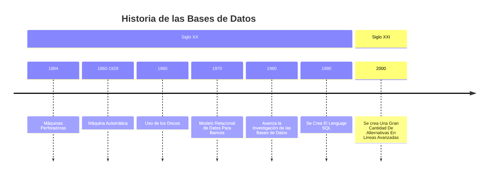

## ¿Por qué Son Importantes?

Almacenan, manejan y gestionan la información de forma veloz, oportuna y confiable. Ofrecen resultados de comportamientos, tendencias o estadísticas. Las bases de datos son el corazón de la gestión de la información.

A lo largo de la historia, la forma de almacenar datos ha ido cambiando significativamente, como se puede ver en la siguiente línea de tiempo.

## Datos Vs Información

A la hora de operar con bases de datos debemos tener en cuenta el hecho de que existe una diferencia entre lo que es un dato y lo que es la información. Un **Dato** es un hecho con el cual se describe cualquier cosa dentro del entorno en el que convivimos. Una **Información** es una agrupación de datos ordenados de una forma específica para generar un concepto relevante.

En el caso de las bases de datos, decimos que un **dato** es un atributo, mientras que una **información** hace referencia a una entidad.

> [!TIP] Ejemplo
> En un contexto de empresa, decir que las ventas son $10000 es un **dato**, porque realmente no nos dice nada. Sin embargo, decir que las ventas han crecido un 5% respecto a un año anterior es un tipo de **información**, debido a que nos da un contexto aparte del número.

Hoy en día, nos referimos a una base de datos como un archivo electrónico en el que se almacena información. Un ejemplo de esto puede ser un `.csv`, el cual es un archivo en el que se encuentra una información lineal separada por una `,` y un `;`.

> [!WARNING] A Tener En Cuenta
> Si en una base de datos no podemos garantizar una gestión de la información de una forma veloz, oportuna y confiable, entonces podemos considerar que es una mala base de datos.

## Requerimientos De Una Base de Datos

El concepto de una base de datos está ligado a 3 requerimientos básicos que debe cumplir cualquier sistema para ser considerado como una base de datos:

1. Debe tener la capacidad de definir datos.
2. Debe ser capaz de poder compartir los datos que tenga en su interior.
3. Debe de tener una estructura gráfica que muestre la forma en la que se organizan los datos.

### Tipos de Bases de Datos

#### Bases de datos Relacionales

Las bases de datos relacionales organizan la información en tablas con filas y columnas, donde cada fila representa un registro y cada columna un atributo o campo de ese registro. Estas bases de datos utilizan un modelo basado en relaciones matemáticas, lo que facilita la integridad de los datos a través de llaves primarias y foráneas. Un lenguaje comúnmente usado para interactuar con bases de datos relacionales es SQL (Structured Query Language), y entre los ejemplos más conocidos están MySQL, PostgreSQL y Oracle.

#### Bases de datos No Relacionales

Las bases de datos no relacionales, también conocidas como NoSQL, se estructuran de manera más flexible que las relacionales, almacenando datos en formatos como documentos, grafos, pares clave-valor, o columnas anchas. Este tipo de bases de datos está diseñado para manejar grandes volúmenes de datos distribuidos y no estructurados, adaptándose mejor a la escalabilidad horizontal. MongoDB, Cassandra y Redis son ejemplos de bases de datos NoSQL.

#### Bases de datos Jerárquicas

Las bases de datos jerárquicas organizan los datos en una estructura de árbol, donde cada registro tiene una relación padre-hijo, creando un esquema de dependencia en niveles. Cada nodo tiene un solo "padre", pero puede tener múltiples "hijos", lo que refleja una estructura similar a la de un árbol de directorios de archivos. Este modelo es más eficiente para datos que siguen una jerarquía natural, como en sistemas de inventario. Un ejemplo clásico de este tipo es IMS de IBM.

#### Bases de datos en Red

Las bases de datos en red son una evolución de las bases de datos jerárquicas, permitiendo que los registros tengan múltiples relaciones padre-hijo, creando una estructura más flexible y de grafos. Esta organización es útil para representar relaciones complejas donde los datos no siguen una única jerarquía rígida. Los sistemas de bases de datos en red permiten acceder a los datos a través de nodos y enlaces entre ellos. Un ejemplo de este tipo de bases de datos es el modelo CODASYL.

## Características de una Base de Datos

- Una base de datos tiene una independencia Lógica y Física de los datos.
- Permite un acceso concurrente de múltiples usuarios a la misma.
- Se enfoca en proteger la integridad de los datos que almacena.
- Siempre debe de tener un respaldo y una recuperación de la información que almacena.

### Operaciones de una Base de Datos

Las siguientes operaciones aplican para las bases de datos relacionales y no relacionales, y son todas aquellas que debe manejar un sistema de información básico:

- **Navegación**: Implica recorrer y acceder a los datos almacenados dentro de la base de datos. En una base de datos relacional, se navega a través de tablas y relaciones entre ellas, mientras que en una no relacional, se recorre la estructura de documentos, grafos o colecciones según el modelo empleado. La navegación eficiente permite moverse entre conjuntos de datos interconectados.
    
- **Consultas**: Consiste en buscar información específica dentro de la base de datos a través de consultas, las cuales pueden ser simples o complejas, dependiendo de los criterios y filtros que se apliquen. En bases de datos relacionales, las consultas se realizan a través de SQL, mientras que en NoSQL se utilizan lenguajes específicos como MongoDB Query Language. Las consultas son fundamentales para obtener datos relevantes de grandes volúmenes de información.
    
- **Ordenamiento**: Es la capacidad de organizar los datos según ciertos criterios o campos. En una base de datos relacional, por ejemplo, se puede ordenar por una columna específica de una tabla, mientras que en las bases NoSQL, el ordenamiento puede estar basado en atributos del documento o por una clave. El ordenamiento permite a los usuarios presentar la información de manera coherente y según sus necesidades.
    
- **Eliminación**: Involucra borrar registros o conjuntos de datos dentro de la base de datos. Esta operación debe ser realizada con cuidado, ya que la eliminación de datos puede ser irreversible en algunos casos. En bases relacionales, puede implicar la eliminación de filas de una tabla con el comando `DELETE`, y en bases NoSQL, eliminar documentos o entradas de colecciones.
    
- **Actualización**: Se refiere a la modificación de datos ya almacenados dentro de la base de datos. En bases de datos relacionales, las actualizaciones suelen realizarse con el comando `UPDATE`, mientras que en NoSQL se actualizan los valores de los campos o atributos específicos en documentos o registros. Esta operación es esencial para mantener la base de datos actualizada con la información más reciente.
    
- **Reportes**: Los reportes son salidas organizadas de los datos en formatos accesibles para los usuarios, como tablas, gráficos o resúmenes. Los sistemas de bases de datos permiten generar reportes que agrupan, filtran y presentan la información de manera comprensible, ya sea para fines analíticos, toma de decisiones o auditorías. Los reportes se basan en consultas específicas y suelen formatearse en documentos, hojas de cálculo, o gráficos.

## ¿Cuándo es pertinente usar una Base De Datos?

- **Cuando los datos a almacenar son grandes**: Las bases de datos son fundamentales cuando el volumen de información es demasiado grande para gestionarlo de manera eficiente mediante métodos convencionales, como archivos locales. Estas estructuras permiten organizar, acceder y procesar grandes cantidades de datos de manera optimizada, asegurando tiempos de respuesta razonables y capacidad de escalabilidad.
    
- **Cuando su uso sea necesario y constante**: Si la información debe ser consultada, modificada o procesada frecuentemente, una base de datos permite manejar estas operaciones de manera rápida y eficiente. Esto es particularmente importante en sistemas que dependen de consultas recurrentes y la actualización constante de información, como plataformas web, sistemas de gestión empresarial, y aplicaciones móviles.
    
- **Cuando las transacciones que se ejecuten deban de quedar registradas y estén protegidas ante cualquier fallo**: En aplicaciones críticas, como sistemas financieros o bancarios, las bases de datos garantizan que cada operación sea registrada adecuadamente y que, ante un fallo o interrupción, los datos se mantengan íntegros. Esto se logra a través de mecanismos de control de transacciones (ACID), que aseguran la fiabilidad de las operaciones incluso ante fallos.
    
- **Cuando una gran cantidad de usuarios van a manipular la información, mitigando así los problemas de integridad y controlando la concurrencia**: En entornos donde múltiples usuarios necesitan acceder y modificar los mismos datos simultáneamente, las bases de datos proporcionan mecanismos de control de concurrencia y de integridad, evitando conflictos o inconsistencias. Esto es clave en sistemas colaborativos o de alta demanda, como redes sociales, plataformas de comercio electrónico, o sistemas empresariales compartidos.

## Niveles de Abstracción de una Base de datos

Dependen del detalle de las estructuras de datos complejos.

- **Nivel Interno**: En el se determina físicamente la localización de la base de datos. Un ejemplo de este caso: un Sistema Gestor de Bases de Datos sería la parte del nivel físico.
- **Nivel Conceptual**: En el se describe la organización de los archivos (También se le conoce como nivel lógico). Un ejemplo de este caso: Un administrador de una base de datos (o **DBA**).
- **Nivel Externo**: Restringe a los usuarios para que vean solo una parte de datos (Todos aquellos datos que les interesan). Un ejemplo de este caso: Los usuarios finales corresponden al nivel externo.

## Preguntas Para Iniciar El Diseño de Una Base de Datos

- **¿Qué tengo?**: Esta pregunta busca entender los recursos y la información disponibles. Implica identificar los datos existentes, su estructura, su formato, y su relevancia. Es el punto de partida para comprender el estado actual del sistema de información, los procesos involucrados, y las necesidades de almacenamiento de datos. Evaluar qué se tiene permite establecer las bases para el diseño y determinar qué debe ser incluido o mejorado en la base de datos.
    
- **¿Qué quiero?**: Aquí se define el objetivo final del diseño de la base de datos. Es crucial especificar qué se espera lograr: ¿Es un sistema para almacenar datos de clientes, realizar transacciones financieras, o gestionar inventarios? Esta pregunta también abarca aspectos como la escalabilidad, seguridad, y rendimiento deseado. Tener una visión clara de lo que se quiere alcanzar es clave para orientar el diseño y las funcionalidades de la base de datos.
    
- **¿Qué hago para llegar allí?**: Esta etapa implica la planificación de cómo convertir los datos y recursos actuales en el sistema que se desea. Requiere determinar qué cambios, transformaciones, o agregados son necesarios. Puede incluir la creación de nuevos modelos de datos, establecer relaciones entre entidades, optimizar la estructura de los datos, o adoptar nuevas tecnologías. Esta planificación también contempla las herramientas y el equipo que se necesita para llegar a la meta.
    
- **¿Cómo voy a construirlo?**: En este punto, se definen los aspectos técnicos y metodológicos del diseño y la implementación de la base de datos. Incluye seleccionar la tecnología adecuada (bases de datos relacionales o NoSQL, por ejemplo), definir el esquema de la base de datos, los índices, las restricciones de integridad y los mecanismos de seguridad. También abarca el proceso de desarrollo, los roles de los miembros del equipo, las etapas de prueba, y los mecanismos de despliegue del sistema final.